# Tài liệu Thiết kế Class Diagram — Hệ thống ATS

Tài liệu này mô tả sơ đồ lớp (Class Diagram) của hệ thống **ATS (Applicant Tracking System)**. Thiết kế này được ánh xạ trực tiếp từ cấu trúc dữ liệu cơ sở (Prisma Schema / MariaDB) lên các mô hình đối tượng (Domain Entities) được sử dụng trong toàn bộ luồng xử lý Backend (Next.js API Routes, Prisma Client, Zod Schema).

---

## 1. Sơ đồ Class Diagram (Mermaid)

Dưới đây là sơ đồ quan hệ giữa các lớp trong hệ thống ATS. Sơ đồ mô tả các thuộc tính chính, kiểu dữ liệu và mối quan hệ (1-1, 1-N, N-N thông qua bảng liên kết).

```mermaid
classDiagram
    direction TB

    %% Enums Definition
    class UserRole {
        <<enumeration>>
        candidate
        admin
        hr
        interviewer
    }

    class OtpType {
        <<enumeration>>
        email_verify
        password_reset
    }

    class JobChannelName {
        <<enumeration>>
        linkedin
        itviec
        topcv
        vietnamworks
        website
    }

    class JobChannelStatus {
        <<enumeration>>
        pending
        posted
        failed
        expired
        removed
    }

    class ApplicationStatus {
        <<enumeration>>
        applied
        screening
        interviewing
        offered
        hired
        rejected
    }

    class ApplicationSourceChannel {
        <<enumeration>>
        linkedin
        itviec
        topcv
        vietnamworks
        website
    }

    class InterviewType {
        <<enumeration>>
        phone
        video
        onsite
        technical
    }

    class InterviewStatus {
        <<enumeration>>
        scheduled
        completed
        cancelled
        rescheduled
    }

    class EvaluatorRole {
        <<enumeration>>
        evaluator
        observer
        final_reviewer
    }

    class InterviewScoreResult {
        <<enumeration>>
        pass
        fail
        hold
    }

    class JobEmploymentType {
        <<enumeration>>
        full_time
        part_time
        contract
    }

    class JobStatus {
        <<enumeration>>
        draft
        pending
        active
        closed
        archived
    }

    class EmailLogType {
        <<enumeration>>
        invite
        result
        reminder
        rejection
        offer
    }

    class EmailLogStatus {
        <<enumeration>>
        pending
        sent
        failed
    }

    %% Classes Definition
    class User {
        +String id (UUID)
        +String email
        +String passwordHash
        +String fullName
        +String phone
        +UserRole role
        +String avatarUrl
        +Boolean isActive
        +Boolean emailVerified
        +DateTime lastLoginAt
        +DateTime createdAt
        +DateTime updatedAt
    }

    class CandidateProfile {
        +String id (UUID)
        +String userId
        +String title
        +String bio
        +String location
        +Int yearsExperience
        +Json skills
        +Json education
        +String linkedinUrl
        +String githubUrl
        +DateTime createdAt
        +DateTime updatedAt
    }

    class Job {
        +String id (UUID)
        +String createdBy
        +String title
        +String slug
        +String description
        +String requirements
        +String benefits
        +String location
        +String department
        +String category
        +Int salaryMin
        +Int salaryMax
        +JobEmploymentType employmentType
        +Json requiredSkills
        +Int headcount
        +JobStatus status
        +DateTime expiresAt
        +DateTime publishedAt
        +DateTime createdAt
        +DateTime updatedAt
    }

    class JobChannel {
        +String id (UUID)
        +String jobId
        +JobChannelName channel
        +String externalUrl
        +String externalId
        +JobChannelStatus status
        +DateTime postedAt
        +DateTime expiresAt
        +String errorMessage
        +DateTime createdAt
    }

    class Application {
        +String id (UUID)
        +String jobId
        +String candidateId
        +String cvFileUrl
        +String cvFilename
        +String coverLetter
        +ApplicationStatus status
        +ApplicationSourceChannel sourceChannel
        +DateTime appliedAt
        +DateTime updatedAt
    }

    class ApplicationStatusHistory {
        +String id (UUID)
        +String applicationId
        +String changedBy
        +String fromStatus
        +String toStatus
        +String note
        +DateTime changedAt
    }

    class Interview {
        +String id (UUID)
        +String applicationId
        +DateTime scheduledAt
        +Int durationMinutes
        +InterviewType type
        +InterviewStatus status
        +String meetingLink
        +String location
        +String notes
        +DateTime createdAt
    }

    class InterviewEvaluator {
        +String id (UUID)
        +String interviewId
        +String userId
        +EvaluatorRole role
        +DateTime createdAt
    }

    class InterviewScore {
        +String id (UUID)
        +String interviewId
        +String evaluatorId
        +Int technicalScore
        +Int communicationScore
        +Int culturalFitScore
        +Int problemSolvingScore
        +String strengths
        +String weaknesses
        +String feedback
        +DateTime createdAt
    }

    class InterviewResult {
        +String id (UUID)
        +String interviewId
        +String reviewerId
        +InterviewScoreResult result
        +String feedback
        +DateTime createdAt
    }

    class EmailLog {
        +String id (UUID)
        +String applicationId
        +String recipientId
        +String senderId
        +String subject
        +EmailLogType type
        +EmailLogStatus status
        +DateTime sentAt
        +String errorMessage
        +DateTime createdAt
    }

    class File {
        +String id (UUID)
        +String userId
        +String fileName
        +String fileUrl
        +String fileType
        +String appwriteId
        +DateTime createdAt
        +DateTime updatedAt
    }

    class OtpToken {
        +String id (UUID)
        +String email
        +String code
        +OtpType type
        +Int attempts
        +DateTime expiresAt
        +DateTime usedAt
        +DateTime createdAt
    }

    %% Relationships
    User "1" -- "0..1" CandidateProfile : candidate_profiles (Cascade)
    User "1" -- "*" Job : jobs
    User "1" -- "*" Application : applications
    User "1" -- "*" File : files (Cascade)
    User "1" -- "*" InterviewEvaluator : interview_evaluators (Cascade)
    User "1" -- "*" InterviewScore : interview_scores
    User "1" -- "*" InterviewResult : interview_results (Cascade)
    User "1" -- "*" ApplicationStatusHistory : application_status_history
    User "1" -- "*" EmailLog : email_logs_as_recipient
    User "1" -- "*" EmailLog : email_logs_as_sender

    Job "1" -- "*" Application : applications
    Job "1" -- "*" JobChannel : job_channels (Cascade)

    Application "1" -- "*" Interview : interviews
    Application "1" -- "*" ApplicationStatusHistory : application_status_history (Cascade)
    Application "1" -- "*" EmailLog : email_logs

    Interview "1" -- "*" InterviewEvaluator : interview_evaluators (Cascade)
    Interview "1" -- "*" InterviewScore : interview_scores
    Interview "1" -- "0..1" InterviewResult : interview_result (Cascade)
```

---

## 2. Chi tiết các Lớp thực thể (Domain Entities)

### 2.1. Lớp xác thực & Người dùng (User & Security)

#### **User**
Lớp trung tâm đại diện cho tất cả các đối tượng tương tác trong hệ thống (Ứng viên, HR, Admin, Người phỏng vấn).
*   `id`: Chuỗi UUID định danh duy nhất (36 ký tự).
*   `email`: Email đăng nhập (duy nhất, dùng để xác thực).
*   `passwordHash`: Mật khẩu được mã hóa an toàn qua `bcrypt`. Có thể null nếu đăng nhập qua OAuth.
*   `fullName`: Họ và tên hiển thị.
*   `phone`: Số điện thoại liên lạc.
*   `role`: Quyền truy cập trong hệ thống (Enum `UserRole`).
*   `avatarUrl`: Đường dẫn ảnh đại diện (Lưu trên bộ lưu trữ Appwrite).
*   `isActive`: Trạng thái hoạt động của tài khoản (cho phép Admin chặn/khóa tài khoản).
*   `emailVerified`: Cờ xác nhận đã xác minh email qua mã OTP.
*   `lastLoginAt`: Thời gian đăng nhập gần nhất.

#### **OtpToken**
Quản lý mã OTP dùng một lần cho việc xác minh email và khôi phục mật khẩu.
*   `email`: Email nhận OTP.
*   `code`: Mã OTP đã được hash.
*   `type`: Loại OTP (Enum `OtpType` - verify email hoặc reset password).
*   `attempts`: Số lần nhập sai (dùng để chặn brute force, tối đa 3-5 lần).
*   `expiresAt`: Thời gian hết hạn của OTP (thông thường là 5-10 phút).
*   `usedAt`: Thời điểm OTP đã được sử dụng thành công.

---

### 2.2. Lớp Ứng viên & Hồ sơ (Candidate & Resume)

#### **CandidateProfile**
Mở rộng thông tin chuyên môn cho người dùng có quyền `candidate`. Thiết kế mối quan hệ 1-1 với lớp `User`.
*   `userId`: Định danh người dùng tương ứng (Khóa ngoại kết nối sang `User.id`).
*   `title`: Vị trí ứng tuyển mong muốn (ví dụ: Frontend Developer, HR Manager).
*   `bio`: Giới thiệu ngắn về bản thân.
*   `location`: Thành phố/Quốc gia sinh sống.
*   `yearsExperience`: Số năm kinh nghiệm làm việc thực tế.
*   `skills`: Dữ liệu dạng `Json` lưu danh sách các kỹ năng chuyên môn.
*   `education`: Dữ liệu dạng `Json` lưu trữ lịch sử học vấn (Trường học, ngành học, năm tốt nghiệp).
*   `linkedinUrl` / `githubUrl`: Các đường liên kết mạng xã hội nghề nghiệp.

#### **File**
Lưu trữ thông tin siêu dữ liệu (metadata) của các tệp tin người dùng đăng tải trực tiếp lên bộ lưu trữ **Appwrite Storage**.
*   `userId`: Người tải lên (chủ sở hữu file).
*   `fileName`: Tên file gốc (ví dụ: `NguyenVanA_CV.pdf`).
*   `fileUrl`: Đường dẫn URL tải file trực tiếp từ Appwrite.
*   `fileType`: Phân loại tệp tin (ví dụ: `cv`, `portfolio`, `certificate`, `avatar`).
*   `appwriteId`: ID tệp tin được sinh ra trên hệ thống Appwrite.

---

### 2.3. Lớp Công việc & Kênh tuyển dụng (Jobs & Multi-channel)

#### **Job**
Đại diện cho tin tuyển dụng được tạo và quản lý bởi HR hoặc Admin.
*   `createdBy`: ID tài khoản HR/Admin tạo tin (Khóa ngoại kết nối sang `User.id`).
*   `title`: Tiêu đề công việc (ví dụ: Senior React Developer).
*   `slug`: Đường dẫn URL thân thiện được sinh tự động từ `title` (duy nhất, dùng cho SEO).
*   `description`: Mô tả chi tiết công việc.
*   `requirements`: Yêu cầu công việc (kỹ năng, kinh nghiệm, bằng cấp).
*   `benefits`: Quyền lợi và chế độ đãi ngộ.
*   `location`: Địa điểm làm việc (ví dụ: Quận 1, TP.HCM hoặc Remote).
*   `department` / `category`: Phòng ban và danh mục ngành nghề.
*   `salaryMin` / `salaryMax`: Dải lương (khoảng tối thiểu - tối đa).
*   `employmentType`: Hình thức làm việc (Full-time, Part-time, Contract).
*   `requiredSkills`: Dữ liệu `Json` chứa danh sách các kỹ năng bắt buộc đối với công việc.
*   `headcount`: Số lượng cần tuyển dụng.
*   `status`: Trạng thái của tin tuyển dụng (Draft, Pending, Active, Closed, Archived).

#### **JobChannel**
Quản lý trạng thái phân phối tin tuyển dụng sang các nền tảng đa kênh bên ngoài (Multi-channel distribution).
*   `jobId`: ID tin tuyển dụng (Khóa ngoại kết nối `Job.id`).
*   `channel`: Kênh đăng tin tuyển dụng (Enum `JobChannelName`: LinkedIn, ITviec, TopCV, Vietnamworks, Website).
*   `externalUrl`: Đường dẫn của tin tuyển dụng sau khi được đăng thành công trên kênh tương ứng.
*   `externalId`: ID của tin trên hệ thống bên thứ ba.
*   `status`: Trạng thái phân phối (Pending, Posted, Failed, Expired, Removed).
*   `errorMessage`: Ghi nhận lỗi nếu quá trình đăng tin tự động hoặc kết nối API thất bại.

---

### 2.4. Lớp Quy trình Ứng tuyển (Applications & Pipelines)

#### **Application**
Đơn ứng tuyển của Candidate vào một Job cụ thể. Lớp này làm cầu nối quan hệ N-N giữa `User` (Candidate) và `Job`.
*   `jobId`: ID vị trí tuyển dụng (Khóa ngoại kết nối `Job.id`).
*   `candidateId`: ID của ứng viên (Khóa ngoại kết nối `User.id`).
*   `cvFileUrl`: Đường dẫn tải CV đính kèm trực tiếp của đơn hàng ứng tuyển này.
*   `cvFilename`: Tên file CV.
*   `coverLetter`: Thư giới thiệu bản thân của ứng viên.
*   `status`: Trạng thái hiện tại của đơn trong pipeline tuyển dụng (Enum `ApplicationStatus`: Applied, Screening, Interviewing, Offered, Hired, Rejected).
*   `sourceChannel`: Nguồn mà ứng viên biết tin tuyển dụng (Enum `ApplicationSourceChannel` tương ứng với các Job Channels).

#### **ApplicationStatusHistory**
Ghi lại nhật ký kiểm toán (audit log) mỗi lần trạng thái đơn ứng tuyển thay đổi trong pipeline.
*   `applicationId`: Đơn ứng tuyển tương ứng (Khóa ngoại kết nối `Application.id`).
*   `changedBy`: Người thực hiện thay đổi trạng thái (HR hoặc Admin).
*   `fromStatus`: Trạng thái cũ trước khi chuyển đổi.
*   `toStatus`: Trạng thái mới sau khi chuyển đổi.
*   `note`: Ghi chú hoặc lý do thay đổi (ví dụ: "Ứng viên trả lời phỏng vấn tốt", "CV thiếu kỹ năng phù hợp").
*   `changedAt`: Thời gian thay đổi.

---

### 2.5. Lớp Phỏng vấn & Đánh giá (Interviews & Evaluation)

#### **Interview**
Lên lịch phỏng vấn giữa ứng viên (thông qua đơn ứng tuyển) và hội đồng tuyển dụng.
*   `applicationId`: ID đơn ứng tuyển tương ứng (Khóa ngoại kết nối `Application.id`).
*   `scheduledAt`: Thời gian bắt đầu buổi phỏng vấn.
*   `durationMinutes`: Thời lượng phỏng vấn dự kiến (phút, mặc định là 60 phút).
*   `type`: Hình thức phỏng vấn (Enum `InterviewType`: Phone, Video, Onsite, Technical).
*   `status`: Trạng thái phỏng vấn (Scheduled, Completed, Cancelled, Rescheduled).
*   `meetingLink`: Đường dẫn phòng họp trực tuyến (Google Meet, MS Teams, Zoom).
*   `location`: Địa chỉ cụ thể nếu phỏng vấn trực tiếp (onsite).
*   `notes`: Ghi chú chuẩn bị cho buổi phỏng vấn.

#### **InterviewEvaluator**
Bảng trung gian thiết lập danh sách nhiều người phỏng vấn (`Interviewer`) tham gia một buổi phỏng vấn cụ thể (Thiết lập quan hệ N-N giữa `Interview` và `User`).
*   `interviewId`: Buổi phỏng vấn tương ứng.
*   `userId`: Người phỏng vấn được phân công.
*   `role`: Vai trò trong hội đồng (Enum `EvaluatorRole`: evaluator, observer, final_reviewer).

#### **InterviewScore**
Bảng điểm đánh giá (Scorecard) chi tiết của từng người phỏng vấn dành cho ứng viên. Mỗi người phỏng vấn trong buổi phỏng vấn được tạo tối đa 1 Scorecard.
*   `interviewId`: ID buổi phỏng vấn.
*   `evaluatorId`: Người thực hiện đánh giá (Interviewer).
*   `technicalScore`: Điểm kỹ thuật (Thang điểm 1-5 hoặc 1-10).
*   `communicationScore`: Điểm kỹ năng giao tiếp.
*   `culturalFitScore`: Điểm độ phù hợp văn hóa.
*   `problemSolvingScore`: Điểm kỹ năng giải quyết vấn đề.
*   `strengths`: Nhận xét các điểm mạnh của ứng viên.
*   `weaknesses`: Nhận xét các điểm yếu cần lưu ý.
*   `feedback`: Đánh giá chi tiết tổng hợp.

#### **InterviewResult**
Kết quả phỏng vấn cuối cùng của buổi phỏng vấn, thường do HR Lead hoặc Final Reviewer chốt quyết định.
*   `interviewId`: ID buổi phỏng vấn.
*   `reviewerId`: Người đưa ra quyết định cuối cùng.
*   `result`: Kết quả phỏng vấn (Enum `InterviewScoreResult`: pass, fail, hold).
*   `feedback`: Lý do đưa ra quyết định.

---

### 2.6. Lớp Log & Tương tác (Communication Logs)

#### **EmailLog**
Lưu vết các email được gửi tự động từ hệ thống tới ứng viên (thư mời phỏng vấn, thư từ chối, thư mời nhận việc...).
*   `applicationId`: Đơn ứng tuyển liên quan.
*   `recipientId`: ID người nhận (thường là Candidate).
*   `senderId`: ID người gửi (thường là HR/Admin thực hiện thao tác gửi, hoặc null nếu email hệ thống tự động).
*   `subject`: Tiêu đề email.
*   `type`: Loại email gửi đi (Enum `EmailLogType`: invite, result, reminder, rejection, offer).
*   `status`: Trạng thái gửi email (Pending, Sent, Failed).
*   `sentAt`: Thời điểm email được gửi đi thành công.
*   `errorMessage`: Ghi lỗi chi tiết nếu gửi email thất bại.

---

## 3. Các Quy tắc Thiết kế & Ràng buộc (Design Constraints)

1.  **Xác thực và Phân quyền (Security & RBAC):**
    *   Tất cả các API yêu cầu xác thực đều đọc thông tin `role` của `User` từ session JWT (được truyền trong HTTP-only Cookie).
    *   Truy cập vào các phân hệ như `/dashboard` được phân quyền thông qua lớp kiểm soát middleware dựa trên giá trị `User.role`.
2.  **Ràng buộc toàn vẹn dữ liệu (Referential Integrity & Cascades):**
    *   **Xóa User:** Khi một tài khoản `User` bị xóa, lớp `CandidateProfile` và các bản ghi `File` liên quan sẽ tự động bị xóa theo (`onDelete: Cascade`). Các đơn ứng tuyển `Application` của ứng viên đó sẽ được giữ lại hoặc xử lý nghiệp vụ để lưu trữ lịch sử, không xóa cascade bừa bãi.
    *   **Xóa Job:** Khi xóa một tin tuyển dụng `Job`, toàn bộ các cấu hình đăng tin đa kênh `JobChannel` liên quan sẽ bị xóa (`onDelete: Cascade`). Tuy nhiên, nếu tin tuyển dụng đã có `Application` của ứng viên, hệ thống sẽ chặn hành động xóa vật lý mà chuyển sang trạng thái `Archived` (Soft delete) để bảo vệ tính toàn vẹn của dữ liệu ứng tuyển.
    *   **Xóa Buổi phỏng vấn:** Khi xóa một buổi phỏng vấn `Interview`, các bản ghi trung gian `InterviewEvaluator` và kết quả phỏng vấn `InterviewResult` sẽ tự động bị xóa thông qua thiết lập `Cascade`.
3.  **Tối ưu hóa Truy vấn (Indexes):**
    *   Các cột khóa ngoại (`job_id`, `candidate_id`, `application_id`, `user_id`) đều được đánh chỉ mục (`@@index`) để tăng tốc độ truy vấn `JOIN` khi sử dụng Prisma Client.
    *   Các trường thường xuyên dùng để lọc trạng thái (`status`, `isActive`) hoặc tìm kiếm URL (`slug`) cũng được lập chỉ mục riêng biệt nhằm tối ưu hóa hiệu năng cơ sở dữ liệu.
