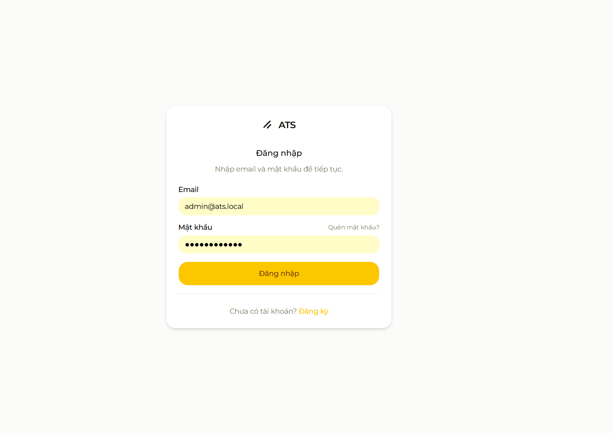
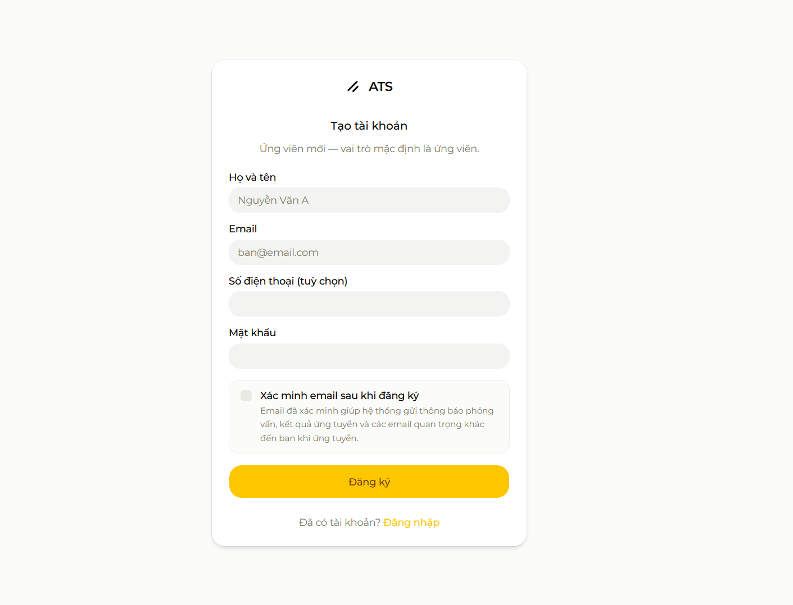
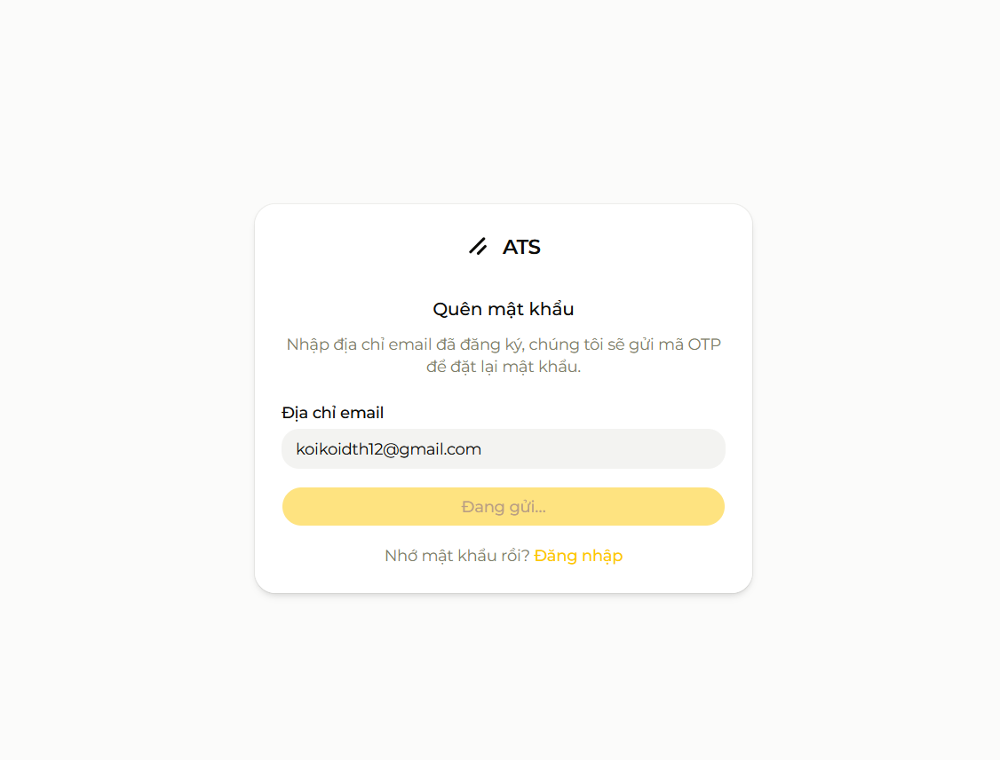
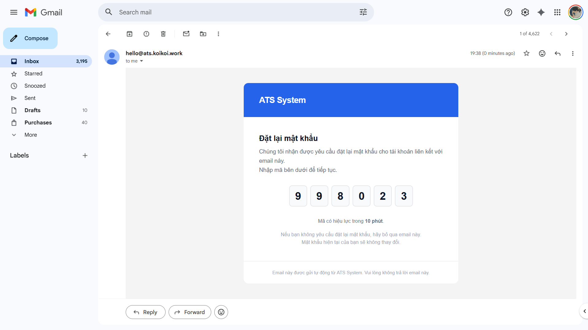
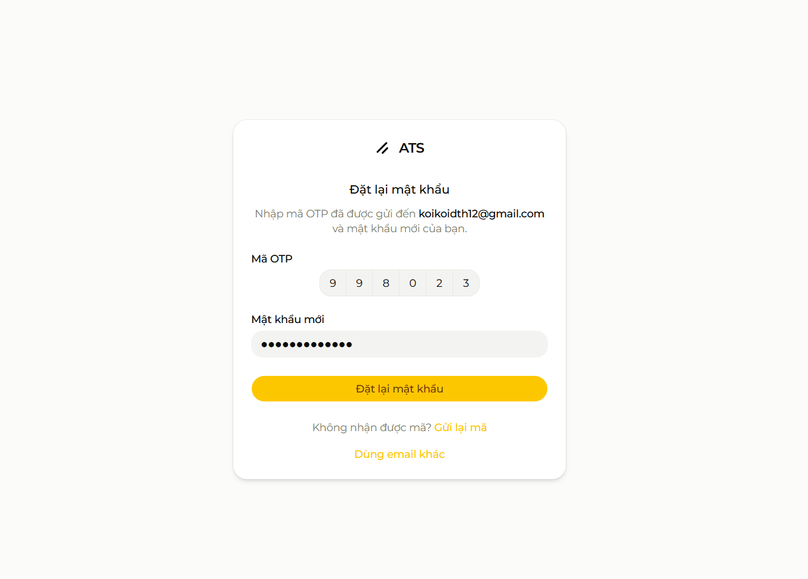

# Module B - Xác thực (Authentication)

**Người phụ trách:** Lê Huỳnh Huy

## Mục lục

1. [Sheet 01 - Khái quát chức năng](#sheet-01)
2. [Sheet 02 - IPO](#sheet-02)
3. [Sheet 03 - IPO Chi tiết](#sheet-03)
4. [Sheet 04 - Chi tiết điều khiển](#sheet-04)
5. [Sheet 05 - Giao diện màn hình](#sheet-05)
6. [Sheet 06 - Thông báo](#sheet-06)
7. [Sheet 07 - API](#sheet-07)
8. [Sheet 08 - Request](#sheet-08)
9. [Sheet 09 - Response](#sheet-09)
10. [Sheet 10 - SQL](#sheet-10)
11. [Lịch sử thay đổi](#lich-su-thay-doi)

---

<a id="sheet-01"></a>
## Sheet 01 - Khái quát chức năng

### 1. Khái quát chức năng

| No | Chức năng | Mô tả | Ghi chú |
|---:|---|---|---|
| 1 | Đăng nhập | Xác thực email + password, phát JWT cookie | Route: `/(auth)/login` |
| 2 | Đăng ký | Tạo tài khoản candidate mới, gửi OTP xác minh email | Route: `/(auth)/register` |
| 3 | Quên mật khẩu | Gửi OTP reset mật khẩu qua email | Route: `/(auth)/forgot-password` |
| 4 | Xác minh email | Nhập OTP để kích hoạt tài khoản | Route: `/(auth)/verify-email` |
| 5 | Đăng xuất | Xóa httpOnly cookie, chuyển về trang chủ | POST `/api/auth/logout` |
| 6 | Lấy thông tin user hiện tại | Đọc JWT cookie, trả về thông tin user đang đăng nhập | GET `/api/auth/me` |
| 7 | Đổi mật khẩu | Đổi mật khẩu khi đang đăng nhập | POST `/api/auth/password` |

### 2. Danh sách table sử dụng

| No | Table | Create | Read | Update | Delete | Ghi chú |
|---:|---|---|---|---|---|---|
| 1 | `users` | [x] | [x] | [x] | - | Tạo user (register), đọc (login/me), cập nhật (last_login_at, email_verified) |
| 2 | `otp_tokens` | [x] | [x] | [x] | - | Tạo OTP, đọc để verify, đánh dấu `used_at` |

### 3. Đối tượng / Bộ phận sử dụng

| Vai trò | Mô tả | Quyền |
|---|---|---|
| Guest (chưa đăng nhập) | Người dùng chưa có hoặc chưa đăng nhập | Truy cập đăng nhập, đăng ký, quên mật khẩu, xác minh email |
| Candidate / HR / Admin / Interviewer | Người dùng đã đăng nhập | Đăng xuất, đổi mật khẩu, xem thông tin bản thân |

---

<a id="sheet-02"></a>
## Sheet 02 - IPO

### 1. Danh sách nhóm chức năng

| No | Nhóm chức năng | Mô tả |
|---:|---|---|
| A | Đăng nhập | Xác thực thông tin, tạo JWT session |
| B | Đăng ký | Tạo tài khoản mới, gửi OTP xác minh |
| C | OTP – Xác minh email | Nhập OTP kích hoạt tài khoản |
| D | OTP – Quên/Đặt lại mật khẩu | Gửi OTP qua email, đặt lại mật khẩu mới |
| E | Đăng xuất | Xóa session cookie |
| F | Lấy thông tin user hiện tại | Đọc JWT từ cookie |
| G | Đổi mật khẩu | Cập nhật password_hash |

### 2. Nhóm A - Đăng nhập

#### Chức năng cấu thành

| No | Chức năng | Mô tả |
|---:|---|---|
| A-1 | Nhập email + password | Form validation client-side trước khi submit |
| A-2 | Xác thực thông tin | So sánh password với bcrypt hash trong DB |
| A-3 | Phát JWT cookie | Ký token với AUTH_SECRET, set httpOnly cookie |
| A-4 | Điều hướng sau đăng nhập | Chuyển đến trang phù hợp theo role |

#### IPO

| | Input | Process | Output |
|---|---|---|---|
| A-1 | email, password | Validate Zod schema | Form data đã validate |
| A-2 | email → DB lookup | `bcrypt.compare(password, user.password_hash)` | user object hoặc lỗi |
| A-3 | userId, email, role, fullName | `signSessionToken()` → JWT HS256 | httpOnly cookie `session` |
| A-4 | role từ JWT | `getPostLoginPath(role)` | Redirect URL |

### 3. Nhóm B - Đăng ký

#### Chức năng cấu thành

| No | Chức năng | Mô tả |
|---:|---|---|
| B-1 | Nhập thông tin đăng ký | fullName, email, password, phone (tùy chọn) |
| B-2 | Kiểm tra email trùng | Không cho đăng ký email đã tồn tại |
| B-3 | Hash password | bcrypt với salt rounds = 12 |
| B-4 | Tạo user | INSERT vào bảng users với role = candidate |
| B-5 | Gửi OTP xác minh email | Tạo OTP token, gửi email qua Resend |

#### IPO

| | Input | Process | Output |
|---|---|---|---|
| B-1 | fullName, email, password, phone | Validate Zod: email format, password ≥8 ký tự | Validated data |
| B-2 | email | `findUnique({ where: { email } })` | Lỗi nếu đã tồn tại |
| B-3 | password plain | `bcrypt.hash(password, 12)` | password_hash |
| B-4 | fullName, email, password_hash, phone | `users.create(...)` | user object |
| B-5 | userId, email | Tạo OTP 6 số, `otp_tokens.create(...)`, Resend email | Email OTP đến user |

### 4. Nhóm C - OTP Xác minh email

#### IPO

| | Input | Process | Output |
|---|---|---|---|
| C-1 | email, otp | Tìm OTP chưa dùng, còn hạn: `otp_tokens WHERE token=? AND type='email_verify' AND used_at IS NULL AND expires_at > NOW()` | OTP record |
| C-2 | OTP hợp lệ | Cập nhật `users.email_verified = true`, cập nhật `otp_tokens.used_at = NOW()` | Tài khoản được kích hoạt |

### 5. Nhóm D - Quên/Đặt lại mật khẩu

#### IPO

| | Input | Process | Output |
|---|---|---|---|
| D-1 | email | Tìm user theo email, tạo OTP type `password_reset`, gửi email qua Resend | Email OTP đến user |
| D-2 | email, otp, newPassword | Verify OTP, hash password mới, cập nhật `users.password_hash`, mark OTP used | Mật khẩu đã cập nhật |

---

<a id="sheet-03"></a>
## Sheet 03 - IPO Chi tiết

### 1. POST /api/auth/login

#### Thông tin xử lý

| Field | Nội dung |
|---|---|
| Tên API | Đăng nhập |
| Method | POST |
| Endpoint | `/api/auth/login` |
| Auth | Public |
| Mô tả | Xác thực email + password, phát JWT httpOnly cookie |

#### Các bước xử lý

| No | Bước | Mô tả | Ghi chú |
|---:|---|---|---|
| 1 | Validate | Zod: email format, password không rỗng | Trả 400 + fieldErrors |
| 2 | Lookup user | `findUnique({ where: { email } })` | Trả 401 nếu không tìm thấy |
| 3 | Check active | Kiểm tra `user.is_active = true` | Trả 403 nếu bị disable |
| 4 | Verify password | `bcrypt.compare(password, password_hash)` | Trả 401 nếu sai |
| 5 | Sign JWT | `signSessionToken({ userId, email, fullName, role })` | Hết hạn: 7 ngày |
| 6 | Set cookie | `Set-Cookie: session=<jwt>; HttpOnly; SameSite=Lax; Secure; Max-Age=604800` | |
| 7 | Update last_login | `users.update({ last_login_at: new Date() })` | Fire-and-forget, không block response |
| 8 | Output | Trả `{ success: true, data: { user: PublicUser } }` | Redirect xử lý client-side |

### 2. POST /api/auth/register

#### Thông tin xử lý

| Field | Nội dung |
|---|---|
| Tên API | Đăng ký tài khoản |
| Method | POST |
| Endpoint | `/api/auth/register` |
| Auth | Public |

#### Các bước xử lý

| No | Bước | Mô tả | Ghi chú |
|---:|---|---|---|
| 1 | Validate | Zod: email format, password ≥8 ký tự, fullName không rỗng | Trả 400 + fieldErrors |
| 2 | Check duplicate | `findUnique({ where: { email } })` | Trả 409 + MSG-B-003 |
| 3 | Hash password | `bcrypt.hash(password, 12)` | |
| 4 | Create user | `users.create(...)` với `role='candidate'`, `is_active=true`, `email_verified=false` | |
| 5 | Generate OTP | 6 số ngẫu nhiên, `expires_at = NOW() + 15 phút`, type = `email_verify` | |
| 6 | Save OTP | `otp_tokens.create(...)` | |
| 7 | Send email | Gửi qua Resend với template OTP xác minh | |
| 8 | Output | Trả `{ success: true, data: { userId, message } }` | Không phát JWT (cần xác minh email trước) |

### 3. POST /api/auth/otp/send

#### Thông tin xử lý

| Field | Nội dung |
|---|---|
| Tên API | Gửi OTP |
| Method | POST |
| Endpoint | `/api/auth/otp/send` |
| Auth | Public |
| Mô tả | Gửi OTP qua email cho mục đích: `email_verify` hoặc `password_reset` |

#### Các bước xử lý

| No | Bước | Mô tả | Ghi chú |
|---:|---|---|---|
| 1 | Validate | email format, type thuộc: email_verify / password_reset | Trả 400 nếu sai |
| 2 | Lookup user | `findUnique({ where: { email } })` | Trả 404 nếu không tìm thấy (chỉ áp dụng password_reset) |
| 3 | Invalidate OTP cũ | Cập nhật `used_at = NOW()` cho OTP cũ chưa hết hạn cùng type | Tránh nhiều OTP song song |
| 4 | Generate OTP | 6 số ngẫu nhiên, expires_at = NOW() + 15 phút | |
| 5 | Save OTP | `otp_tokens.create(...)` | |
| 6 | Send email | Resend API | Trả 500 nếu gửi lỗi |
| 7 | Output | `{ success: true, data: { message: "OTP đã được gửi" } }` | |

### 4. POST /api/auth/otp/verify-email

#### Các bước xử lý

| No | Bước | Mô tả | Ghi chú |
|---:|---|---|---|
| 1 | Validate | email không rỗng, token 6 số | Trả 400 |
| 2 | Lookup OTP | `findFirst({ where: { user.email, token, type:'email_verify', used_at: null } })` | |
| 3 | Kiểm tra hết hạn | `expires_at > NOW()` | Trả 400 + MSG-B-007 nếu hết hạn |
| 4 | Mark used | `otp_tokens.update({ used_at: NOW() })` | |
| 5 | Activate user | `users.update({ email_verified: true })` | |
| 6 | Phát JWT | Tạo session cookie → đăng nhập ngay | |
| 7 | Output | `{ success: true, data: { user: PublicUser } }` | |

### 5. POST /api/auth/otp/reset-password

#### Các bước xử lý

| No | Bước | Mô tả | Ghi chú |
|---:|---|---|---|
| 1 | Validate | email, token, newPassword ≥8 ký tự | Trả 400 |
| 2 | Lookup OTP | type = `password_reset`, chưa dùng, còn hạn | Trả 400 + MSG-B-007 |
| 3 | Hash new password | `bcrypt.hash(newPassword, 12)` | |
| 4 | Update password | `users.update({ password_hash })` | |
| 5 | Mark OTP used | `otp_tokens.update({ used_at: NOW() })` | |
| 6 | Output | `{ success: true, data: { message: "Mật khẩu đã được đặt lại" } }` | Không tự đăng nhập |

### 6. GET /api/auth/me

#### Các bước xử lý

| No | Bước | Mô tả | Ghi chú |
|---:|---|---|---|
| 1 | Đọc cookie | Lấy giá trị cookie `session` từ request header | |
| 2 | Verify JWT | `verifySessionToken(token)` → payload | Trả 401 nếu invalid/hết hạn |
| 3 | Lookup user | `findUnique({ where: { id: payload.userId } })` | Đảm bảo user vẫn active |
| 4 | Check active | `user.is_active = true` | Trả 401 nếu bị disable |
| 5 | Output | `{ success: true, data: { user: PublicUser } }` | Không trả password_hash |

### 7. POST /api/auth/logout

#### Các bước xử lý

| No | Bước | Mô tả | Ghi chú |
|---:|---|---|---|
| 1 | Clear cookie | `Set-Cookie: session=; Max-Age=0; HttpOnly; ...` | Xóa cookie phía client |
| 2 | Output | `{ success: true }` | Redirect xử lý client-side |

### 8. POST /api/auth/password

#### Các bước xử lý

| No | Bước | Mô tả | Ghi chú |
|---:|---|---|---|
| 1 | Auth check | Verify JWT cookie → userId | Trả 401 nếu chưa đăng nhập |
| 2 | Validate | currentPassword, newPassword ≥8 ký tự, confirm match | Trả 400 |
| 3 | Lookup user | `findUnique({ where: { id: userId } })` | |
| 4 | Verify current | `bcrypt.compare(currentPassword, password_hash)` | Trả 401 + MSG-B-009 |
| 5 | Hash new | `bcrypt.hash(newPassword, 12)` | |
| 6 | Update | `users.update({ password_hash })` | |
| 7 | Output | `{ success: true, data: { message: "Đổi mật khẩu thành công" } }` | |

---

<a id="sheet-04"></a>
## Sheet 04 - Chi tiết điều khiển

### 1. Controls - Trang đăng nhập `/(auth)/login`

| No | Control ID | Tên | Loại | Màn hình | Mô tả |
|---:|---|---|---|---|---|
| 1 | CTR-B-001 | Email Input | Input[email] | Login | Nhập email tài khoản |
| 2 | CTR-B-002 | Password Input | Input[password] | Login | Nhập mật khẩu, có toggle hiện/ẩn |
| 3 | CTR-B-003 | Toggle Show Password | Button/Icon | Login | Hiện/ẩn password input |
| 4 | CTR-B-004 | Nút Đăng nhập | Button[submit] | Login | Submit form đăng nhập |
| 5 | CTR-B-005 | Link Quên mật khẩu | Link | Login | Điều hướng đến `/(auth)/forgot-password` |
| 6 | CTR-B-006 | Link Đăng ký | Link | Login | Điều hướng đến `/(auth)/register` |
| 7 | CTR-B-007 | Error Alert | Alert | Login | Hiển thị lỗi form (sai thông tin, tài khoản bị khóa) |

### 2. Controls - Trang đăng ký `/(auth)/register`

| No | Control ID | Tên | Loại | Màn hình | Mô tả |
|---:|---|---|---|---|---|
| 8 | CTR-B-008 | Full Name Input | Input[text] | Register | Nhập họ tên đầy đủ |
| 9 | CTR-B-009 | Email Input | Input[email] | Register | Nhập email |
| 10 | CTR-B-010 | Phone Input | Input[tel] | Register | Nhập số điện thoại (tùy chọn) |
| 11 | CTR-B-011 | Password Input | Input[password] | Register | Nhập mật khẩu (≥8 ký tự) |
| 12 | CTR-B-012 | Confirm Password | Input[password] | Register | Xác nhận mật khẩu |
| 13 | CTR-B-013 | Toggle Show Password | Button/Icon | Register | Hiện/ẩn cả 2 password field |
| 14 | CTR-B-014 | Nút Đăng ký | Button[submit] | Register | Submit form đăng ký |
| 15 | CTR-B-015 | Link Đăng nhập | Link | Register | Quay lại login |
| 16 | CTR-B-016 | Error Alert | Alert | Register | Hiển thị lỗi (email trùng, form lỗi) |

### 3. Controls - Trang quên mật khẩu `/(auth)/forgot-password`

| No | Control ID | Tên | Loại | Màn hình | Mô tả |
|---:|---|---|---|---|---|
| 17 | CTR-B-017 | Email Input | Input[email] | Forgot Password | Nhập email để gửi OTP reset |
| 18 | CTR-B-018 | Nút Gửi OTP | Button[submit] | Forgot Password | Submit yêu cầu gửi OTP |
| 19 | CTR-B-019 | OTP Input | Input[text] | Forgot Password | Nhập mã OTP 6 số |
| 20 | CTR-B-020 | New Password Input | Input[password] | Forgot Password | Nhập mật khẩu mới |
| 21 | CTR-B-021 | Confirm New Password | Input[password] | Forgot Password | Xác nhận mật khẩu mới |
| 22 | CTR-B-022 | Nút Đặt lại mật khẩu | Button[submit] | Forgot Password | Submit đặt lại mật khẩu |
| 23 | CTR-B-023 | Nút Gửi lại OTP | Button | Forgot Password | Gửi lại OTP sau 60 giây |
| 24 | CTR-B-024 | Đếm ngược OTP | Timer | Forgot Password | Hiển thị thời gian còn lại để gửi lại |

### 4. Controls - Trang xác minh email `/(auth)/verify-email`

| No | Control ID | Tên | Loại | Màn hình | Mô tả |
|---:|---|---|---|---|---|
| 25 | CTR-B-025 | OTP Input | Input[text] | Verify Email | Nhập mã OTP 6 số |
| 26 | CTR-B-026 | Nút Xác minh | Button[submit] | Verify Email | Submit OTP để kích hoạt tài khoản |
| 27 | CTR-B-027 | Nút Gửi lại OTP | Button | Verify Email | Gửi lại OTP sau 60 giây |
| 28 | CTR-B-028 | Đếm ngược OTP | Timer | Verify Email | Hiển thị thời gian còn lại |
| 29 | CTR-B-029 | Thông tin email | Text | Verify Email | Hiển thị email đang xác minh |
| 30 | CTR-B-030 | Success Banner | Alert | Verify Email | Thông báo xác minh thành công |

---

<a id="sheet-05"></a>
## Sheet 05 - Giao diện màn hình

### 1. Danh sách màn hình

| No | Tên màn hình | Route | Loại | Khái quát | Trạng thái |
|---:|---|---|---|---|---|
| 1 | Đăng nhập | `/(auth)/login` | Form | Nhập email/password, submit login | [x] |
| 2 | Đăng ký | `/(auth)/register` | Form | Nhập thông tin tạo tài khoản | [x] |
| 3 | Quên mật khẩu | `/(auth)/forgot-password` | Form multi-step | Nhập email → nhận OTP → đặt lại MK | [x] |
| 4 | Xác minh email | `/(auth)/verify-email` | Form | Nhập OTP kích hoạt tài khoản | [x] |

---

### 2. Màn hình 1 - Đăng nhập `/(auth)/login`



| Field | Nội dung |
|---|---|
| Route / URL | `/(auth)/login` (URL thực tế: `/login`) |
| Tên màn hình | Trang đăng nhập |
| Loại màn hình | Form |
| Khái quát chức năng | Xác thực email + password, tạo session JWT, điều hướng theo role |
| Tác vụ liên quan | Nhập credentials, submit login, điều hướng quên mật khẩu / đăng ký |
| Điều kiện hiển thị | Chỉ cho phép truy cập khi chưa đăng nhập; nếu đã đăng nhập → redirect trang phù hợp |
| Điều kiện không có dữ liệu | N/A |
| Điều hướng từ màn hình này | Sau login: `/candidate`, `/dashboard`; Link: `/register`, `/forgot-password` |
| Điều hướng đến màn hình này | Từ Landing, từ link bảo vệ route, sau logout |
| Liên kết control | CTR-B-001 đến CTR-B-007 |
| Liên kết API | API No.1 (POST /api/auth/login) |
| Liên kết Request | Sheet Request, API No.1 |
| Liên kết Response | Sheet Response, API No.1 |
| Liên kết Message | MSG-B-001, MSG-B-002, MSG-B-004 |
| Ghi chú | Client Component; React Hook Form + Zod |

### 3. Rule hiển thị màn hình 1

| No | Trường hợp | Điều kiện | Nội dung hiển thị | Ghi chú |
|---:|---|---|---|---|
| 1 | Bình thường | Chưa đăng nhập | Form login | CTR-B-001 đến CTR-B-006 |
| 2 | Đang submit | `isLoading = true` | Nút "Đang đăng nhập..." disabled | CTR-B-004 |
| 3 | Lỗi credentials | 401 từ API | Alert "Email hoặc mật khẩu không đúng." | CTR-B-007, MSG-B-001 |
| 4 | Tài khoản bị khóa | 403 từ API | Alert "Tài khoản của bạn đã bị vô hiệu hóa." | CTR-B-007, MSG-B-004 |
| 5 | Đã đăng nhập | session tồn tại | Redirect ngay đến trang phù hợp | Middleware |

### 4. Rule validation màn hình 1

| No | Item | Điều kiện validation | MessageCD | Hành vi khi lỗi |
|---:|---|---|---|---|
| 1 | Email | Bắt buộc, định dạng email hợp lệ | MSG-B-005 | Hiển thị lỗi dưới field, disable submit |
| 2 | Password | Bắt buộc, không rỗng | MSG-B-006 | Hiển thị lỗi dưới field |

---

### 5. Màn hình 2 - Đăng ký `/(auth)/register`



| Field | Nội dung |
|---|---|
| Route / URL | `/(auth)/register` (URL: `/register`) |
| Tên màn hình | Trang đăng ký |
| Loại màn hình | Form |
| Khái quát chức năng | Tạo tài khoản candidate mới, gửi OTP xác minh email tự động |
| Tác vụ liên quan | Nhập thông tin, submit, được redirect đến `/verify-email` |
| Điều kiện hiển thị | Chỉ cho phép truy cập khi chưa đăng nhập |
| Điều kiện không có dữ liệu | N/A |
| Điều hướng từ màn hình này | Sau đăng ký: `/(auth)/verify-email` |
| Điều hướng đến màn hình này | Từ Login, từ Landing CTA |
| Liên kết control | CTR-B-008 đến CTR-B-016 |
| Liên kết API | API No.2 (POST /api/auth/register) |
| Liên kết Request | Sheet Request, API No.2 |
| Liên kết Response | Sheet Response, API No.2 |
| Liên kết Message | MSG-B-002, MSG-B-003, MSG-B-005, MSG-B-006, MSG-B-008 |
| Ghi chú | Sau đăng ký thành công, lưu email vào sessionStorage để dùng ở verify-email |

### 6. Rule validation màn hình 2

| No | Item | Điều kiện validation | MessageCD | Hành vi khi lỗi |
|---:|---|---|---|---|
| 1 | Full Name | Bắt buộc, 2–100 ký tự | MSG-B-008 | Hiển thị lỗi dưới field |
| 2 | Email | Bắt buộc, định dạng hợp lệ | MSG-B-005 | Hiển thị lỗi dưới field |
| 3 | Phone | Tùy chọn; nếu có: 10–15 chữ số | - | Hiển thị lỗi dưới field |
| 4 | Password | Bắt buộc, tối thiểu 8 ký tự | MSG-B-006 | Hiển thị lỗi dưới field |
| 5 | Confirm Password | Phải khớp với Password | MSG-B-010 | Hiển thị lỗi dưới field |

---

### 7. Màn hình 3 - Quên mật khẩu `/(auth)/forgot-password`







| Field | Nội dung |
|---|---|
| Route / URL | `/(auth)/forgot-password` |
| Tên màn hình | Quên mật khẩu |
| Loại màn hình | Form multi-step (Bước 1: Nhập email → Bước 2: Nhập OTP + mật khẩu mới) |
| Khái quát chức năng | Gửi OTP reset mật khẩu qua email, nhập OTP + mật khẩu mới để cập nhật |
| Tác vụ liên quan | Nhập email, nhận OTP, nhập OTP + mật khẩu mới |
| Điều kiện hiển thị | Chỉ cho guest |
| Điều hướng từ màn hình này | Sau reset thành công: `/login` + MSG-B-011 |
| Điều hướng đến màn hình này | Từ link "Quên mật khẩu" trong form login |
| Liên kết control | CTR-B-017 đến CTR-B-024 |
| Liên kết API | API No.4 (POST /api/auth/otp/send), API No.6 (POST /api/auth/otp/reset-password) |
| Liên kết Message | MSG-B-007, MSG-B-009, MSG-B-011 |
| Ghi chú | State machine: step1 (email) → step2 (OTP + new password) |

---

### 8. Màn hình 4 - Xác minh email `/(auth)/verify-email`

| Field | Nội dung |
|---|---|
| Route / URL | `/(auth)/verify-email` |
| Tên màn hình | Xác minh email |
| Loại màn hình | Form |
| Khái quát chức năng | Nhập OTP 6 số nhận qua email để kích hoạt tài khoản |
| Tác vụ liên quan | Nhập OTP, submit, gửi lại OTP |
| Điều kiện hiển thị | Phải có email trong sessionStorage/query param sau bước đăng ký |
| Điều hướng từ màn hình này | Sau verify thành công: `/candidate` (tự đăng nhập) |
| Điều hướng đến màn hình này | Redirect tự động sau đăng ký thành công |
| Liên kết control | CTR-B-025 đến CTR-B-030 |
| Liên kết API | API No.5 (POST /api/auth/otp/verify-email), API No.4 (gửi lại) |
| Liên kết Message | MSG-B-007, MSG-B-012 |
| Ghi chú | Nút "Gửi lại" bị disable 60 giây sau mỗi lần gửi |

### 9. Rule hiển thị màn hình 4

| No | Trường hợp | Điều kiện | Nội dung hiển thị | Ghi chú |
|---:|---|---|---|---|
| 1 | Bình thường | Có email từ sessionStorage | Form nhập OTP + email bị che (abc***@gmail.com) | CTR-B-025, CTR-B-029 |
| 2 | OTP hết hạn | 401/400 từ API | Alert "Mã OTP đã hết hạn" + nút Gửi lại | MSG-B-007 |
| 3 | OTP sai | 400 từ API | Alert "Mã OTP không đúng" | MSG-B-007 |
| 4 | Xác minh thành công | 200 từ API | Banner thành công, redirect sau 2s | CTR-B-030, MSG-B-012 |
| 5 | Cooldown gửi lại | `resendCooldown > 0` | Nút "Gửi lại (60s)" disabled | CTR-B-027, CTR-B-028 |

---

<a id="sheet-06"></a>
## Sheet 06 - Thông báo

### Danh sách thông báo

| MessageCD | Loại | Nội dung | Khi nào hiển thị |
|---|---|---|---|
| MSG-B-001 | Error | "Email hoặc mật khẩu không đúng." | 401 từ POST /login |
| MSG-B-002 | Success | "Đăng nhập thành công! Đang chuyển hướng..." | Login thành công |
| MSG-B-003 | Error | "Email này đã được sử dụng. Vui lòng dùng email khác hoặc đăng nhập." | 409 từ POST /register |
| MSG-B-004 | Error | "Tài khoản của bạn đã bị vô hiệu hóa. Vui lòng liên hệ quản trị viên." | 403 is_active=false |
| MSG-B-005 | Validation | "Vui lòng nhập địa chỉ email hợp lệ." | Zod email format |
| MSG-B-006 | Validation | "Mật khẩu phải có ít nhất 8 ký tự." | Zod min length |
| MSG-B-007 | Error | "Mã OTP không hợp lệ hoặc đã hết hạn. Vui lòng thử lại." | OTP verify fail |
| MSG-B-008 | Validation | "Họ tên không được để trống và tối đa 100 ký tự." | fullName validation |
| MSG-B-009 | Error | "Mật khẩu hiện tại không đúng." | bcrypt compare fail (đổi MK) |
| MSG-B-010 | Validation | "Mật khẩu xác nhận không khớp." | confirm password mismatch |
| MSG-B-011 | Success | "Đặt lại mật khẩu thành công! Vui lòng đăng nhập với mật khẩu mới." | Reset password thành công |
| MSG-B-012 | Success | "Xác minh email thành công! Tài khoản của bạn đã được kích hoạt." | verify-email thành công |
| MSG-B-013 | Success | "Mã OTP đã được gửi đến email của bạn. Vui lòng kiểm tra hộp thư." | Sau khi gửi OTP |
| MSG-B-014 | Success | "Đổi mật khẩu thành công." | POST /api/auth/password thành công |
| MSG-B-015 | System Error | "Đã có lỗi xảy ra. Vui lòng thử lại sau." | 500 từ server |

---

<a id="sheet-07"></a>
## Sheet 07 - API

### 1. Danh sách API

| API No | Tên API | Method | Endpoint | Auth | Ghi chú |
|---:|---|---|---|---|---|
| 1 | Đăng nhập | POST | `/api/auth/login` | Public | Phát JWT cookie |
| 2 | Đăng ký | POST | `/api/auth/register` | Public | Tạo user + gửi OTP |
| 3 | Đăng xuất | POST | `/api/auth/logout` | — | Xóa cookie |
| 4 | Gửi OTP | POST | `/api/auth/otp/send` | Public | email_verify / password_reset |
| 5 | Xác minh email | POST | `/api/auth/otp/verify-email` | Public | Kích hoạt tài khoản |
| 6 | Đặt lại mật khẩu | POST | `/api/auth/otp/reset-password` | Public | Qua OTP |
| 7 | Lấy user hiện tại | GET | `/api/auth/me` | Cookie | Stateless read |
| 8 | Đổi mật khẩu | POST | `/api/auth/password` | Cookie | Khi đã đăng nhập |

---

### 2. API No.1 - POST /api/auth/login

| Field | Nội dung |
|---|---|
| Tên API | Đăng nhập |
| Method | POST |
| Endpoint | `/api/auth/login` |
| Auth | Public |
| Content-Type | application/json |

#### Biến trả về

| Field | Kiểu | Mô tả |
|---|---|---|
| `success` | Boolean | `true` khi thành công |
| `data.user.id` | String | User ID |
| `data.user.email` | String | Email |
| `data.user.fullName` | String | Họ tên |
| `data.user.role` | Enum | candidate / hr / admin / interviewer |
| `data.user.avatarUrl` | String? | URL avatar |
| `data.user.emailVerified` | Boolean | Trạng thái xác minh email |

#### Validation

| Tham số | Kiểu | Bắt buộc | Rule |
|---|---|---|---|
| `email` | String | [x] | Email hợp lệ |
| `password` | String | [x] | Không rỗng |

#### Xử lý thất bại

| Mã lỗi | HTTP Status | Mô tả |
|---|---|---|
| INVALID_CREDENTIALS | 401 | Email/password sai |
| ACCOUNT_DISABLED | 403 | `is_active = false` |
| VALIDATION_ERROR | 400 | Request body không hợp lệ |
| SERVER_ERROR | 500 | Lỗi DB hoặc JWT |

---

### 3. API No.2 - POST /api/auth/register

| Field | Nội dung |
|---|---|
| Tên API | Đăng ký tài khoản |
| Method | POST |
| Endpoint | `/api/auth/register` |
| Auth | Public |

#### Biến trả về

| Field | Kiểu | Mô tả |
|---|---|---|
| `success` | Boolean | `true` khi thành công |
| `data.userId` | String | ID user mới tạo |
| `data.message` | String | Thông báo hướng dẫn xác minh email |

#### Xử lý thất bại

| Mã lỗi | HTTP Status | Mô tả |
|---|---|---|
| EMAIL_TAKEN | 409 | Email đã tồn tại |
| VALIDATION_ERROR | 400 | Dữ liệu không hợp lệ |
| EMAIL_SEND_FAILED | 500 | Gửi email OTP thất bại |

---

### 4. API No.7 - GET /api/auth/me

| Field | Nội dung |
|---|---|
| Tên API | Lấy thông tin user hiện tại |
| Method | GET |
| Endpoint | `/api/auth/me` |
| Auth | httpOnly Cookie JWT |

#### Biến trả về

| Field | Kiểu | Mô tả |
|---|---|---|
| `success` | Boolean | `true` khi thành công |
| `data.user` | Object | PublicUser object |
| `data.user.id` | String | User ID |
| `data.user.email` | String | Email |
| `data.user.fullName` | String | Họ tên |
| `data.user.role` | Enum | Role |
| `data.user.avatarUrl` | String? | URL avatar |
| `data.user.emailVerified` | Boolean | Trạng thái xác minh email |

#### Xử lý thất bại

| Mã lỗi | HTTP Status | Mô tả |
|---|---|---|
| UNAUTHORIZED | 401 | Cookie không có hoặc JWT hết hạn |
| ACCOUNT_DISABLED | 401 | User bị disable |

---

<a id="sheet-08"></a>
## Sheet 08 - Request

### API No.1 - POST /api/auth/login

#### Header

| Header | Giá trị | Ghi chú |
|---|---|---|
| `Content-Type` | `application/json` | |

#### Body (JSON)

| Field | Kiểu | Bắt buộc | Mô tả |
|---|---|---|---|
| `email` | String | [x] | Email tài khoản |
| `password` | String | [x] | Mật khẩu |

#### Ví dụ Request

```json
{
  "email": "candidate@example.com",
  "password": "mypassword123"
}
```

---

### API No.2 - POST /api/auth/register

#### Body (JSON)

| Field | Kiểu | Bắt buộc | Mô tả |
|---|---|---|---|
| `fullName` | String | [x] | Họ tên đầy đủ (2–100 ký tự) |
| `email` | String | [x] | Email |
| `password` | String | [x] | Mật khẩu (≥8 ký tự) |
| `phone` | String | - | Số điện thoại |

#### Ví dụ Request

```json
{
  "fullName": "Nguyễn Văn A",
  "email": "nguyenvana@example.com",
  "password": "SecurePass123",
  "phone": "0901234567"
}
```

---

### API No.4 - POST /api/auth/otp/send

#### Body (JSON)

| Field | Kiểu | Bắt buộc | Mô tả |
|---|---|---|---|
| `email` | String | [x] | Email nhận OTP |
| `type` | String | [x] | `email_verify` hoặc `password_reset` |

#### Ví dụ Request

```json
{
  "email": "nguyenvana@example.com",
  "type": "password_reset"
}
```

---

### API No.5 - POST /api/auth/otp/verify-email

#### Body (JSON)

| Field | Kiểu | Bắt buộc | Mô tả |
|---|---|---|---|
| `email` | String | [x] | Email tài khoản |
| `token` | String | [x] | Mã OTP 6 số |

#### Ví dụ Request

```json
{
  "email": "nguyenvana@example.com",
  "token": "481923"
}
```

---

### API No.6 - POST /api/auth/otp/reset-password

#### Body (JSON)

| Field | Kiểu | Bắt buộc | Mô tả |
|---|---|---|---|
| `email` | String | [x] | Email tài khoản |
| `token` | String | [x] | Mã OTP 6 số |
| `newPassword` | String | [x] | Mật khẩu mới (≥8 ký tự) |

---

### API No.8 - POST /api/auth/password

#### Header

| Header | Giá trị | Ghi chú |
|---|---|---|
| `Cookie` | `session=<JWT>` | Tự động kèm theo |

#### Body (JSON)

| Field | Kiểu | Bắt buộc | Mô tả |
|---|---|---|---|
| `currentPassword` | String | [x] | Mật khẩu hiện tại |
| `newPassword` | String | [x] | Mật khẩu mới (≥8 ký tự) |

---

<a id="sheet-09"></a>
## Sheet 09 - Response

### API No.1 - POST /api/auth/login

#### Success Response (200)

```json
{
  "success": true,
  "data": {
    "user": {
      "id": "user_cuid_001",
      "email": "candidate@example.com",
      "fullName": "Nguyễn Văn A",
      "role": "candidate",
      "avatarUrl": null,
      "emailVerified": true
    }
  }
}
```

> Cookie header: `Set-Cookie: session=eyJhbGci...; HttpOnly; SameSite=Lax; Max-Age=604800`

#### Error Response (401)

```json
{
  "success": false,
  "error": "Email hoặc mật khẩu không đúng."
}
```

---

### API No.2 - POST /api/auth/register

#### Success Response (201)

```json
{
  "success": true,
  "data": {
    "userId": "user_cuid_002",
    "message": "Đăng ký thành công! Vui lòng kiểm tra email để xác minh tài khoản."
  }
}
```

#### Error Response (409)

```json
{
  "success": false,
  "error": "Email này đã được sử dụng. Vui lòng dùng email khác hoặc đăng nhập."
}
```

---

### API No.5 - POST /api/auth/otp/verify-email

#### Success Response (200)

```json
{
  "success": true,
  "data": {
    "user": {
      "id": "user_cuid_002",
      "email": "nguyenvana@example.com",
      "fullName": "Nguyễn Văn A",
      "role": "candidate",
      "avatarUrl": null,
      "emailVerified": true
    }
  }
}
```

> Cookie: `session=<JWT>` được set tự động (đăng nhập ngay sau xác minh)

#### Error Response (400)

```json
{
  "success": false,
  "error": "Mã OTP không hợp lệ hoặc đã hết hạn. Vui lòng thử lại."
}
```

---

### API No.7 - GET /api/auth/me

#### Success Response (200)

```json
{
  "success": true,
  "data": {
    "user": {
      "id": "user_cuid_001",
      "email": "candidate@example.com",
      "fullName": "Nguyễn Văn A",
      "role": "candidate",
      "avatarUrl": "https://appwrite.io/v1/storage/files/xxx/view",
      "emailVerified": true
    }
  }
}
```

#### Error Response (401)

```json
{
  "success": false,
  "error": "Phiên đăng nhập hết hạn. Vui lòng đăng nhập lại."
}
```

---

<a id="sheet-10"></a>
## Sheet 10 - SQL

### 1. Danh sách SQL

| SQL No | Tên SQL / Mục đích | Loại | API sử dụng | Ghi chú |
|---:|---|---|---|---|
| 1 | Tìm user theo email | SELECT | API No.1, No.2, No.4, No.6 | Dùng cho nhiều API |
| 2 | Tạo user mới | INSERT | API No.2 | Transaction |
| 3 | Tạo OTP token | INSERT | API No.2, No.4 | |
| 4 | Kiểm tra và đọc OTP | SELECT | API No.5, No.6 | Kèm điều kiện hợp lệ |
| 5 | Đánh dấu OTP đã dùng | UPDATE | API No.5, No.6 | |
| 6 | Kích hoạt email_verified | UPDATE | API No.5 | |
| 7 | Cập nhật password_hash | UPDATE | API No.6, No.8 | |
| 8 | Cập nhật last_login_at | UPDATE | API No.1 | Fire-and-forget |

---

### 2. SQL No.1 - Tìm user theo email

#### 2.1. Mục đích

Tìm user bằng email. Được dùng để: xác thực login, kiểm tra email trùng khi đăng ký, tìm user để gửi OTP.

#### 2.2. API sử dụng

| API No | Tên API | Method | Ghi chú |
|---:|---|---|---|
| 1 | Đăng nhập | POST | Tìm để so password |
| 2 | Đăng ký | POST | Kiểm tra trùng email |
| 4 | Gửi OTP | POST | Xác nhận user tồn tại |

#### 2.3. Table sử dụng

| No | Table | Alias | Create | Read | Update | Delete | Ghi chú |
|---:|---|---|---|---|---|---|---|
| 1 | `users` | u | - | [x] | - | - | |

#### 2.4. Tham số đầu vào

| Tham số | Kiểu | Bắt buộc | Mô tả | Nguồn |
|---|---|---|---|---|
| `email` | String | [x] | Email tài khoản | Request body |

#### 2.5. SQL

```sql
SELECT
  id, email, password_hash, full_name, phone, role,
  avatar_url, is_active, email_verified, last_login_at
FROM users
WHERE email = ?
LIMIT 1;
```

#### 2.6. Kết quả trả ra

| Field | Kiểu | Mô tả |
|---|---|---|
| `id` | String | User ID |
| `email` | String | Email |
| `password_hash` | String | Bcrypt hash |
| `full_name` | String | Họ tên |
| `role` | Enum | Role người dùng |
| `is_active` | Boolean | Trạng thái hoạt động |
| `email_verified` | Boolean | Đã xác minh email |

#### 2.7. Ghi chú xử lý

| Nội dung | Ghi chú |
|---|---|
| Transaction | Không |
| Index cần lưu ý | Unique index on `users(email)` |

---

### 3. SQL No.2 - Tạo user mới

#### 3.1. Mục đích

Tạo bản ghi user mới khi đăng ký với role mặc định là `candidate`.

#### 3.2. API sử dụng

| API No | Tên API | Method | Ghi chú |
|---:|---|---|---|
| 2 | Đăng ký | POST | Tạo user |

#### 3.3. Table sử dụng

| No | Table | Alias | Create | Read | Update | Delete | Ghi chú |
|---:|---|---|---|---|---|---|---|
| 1 | `users` | u | [x] | - | - | - | |

#### 3.4. Tham số đầu vào

| Tham số | Kiểu | Bắt buộc | Mô tả | Nguồn |
|---|---|---|---|---|
| `id` | String | [x] | CUID/UUID mới | Generated |
| `email` | String | [x] | Email | Request |
| `password_hash` | String | [x] | Bcrypt hash | bcrypt.hash |
| `full_name` | String | [x] | Họ tên | Request |
| `phone` | String | - | Số điện thoại | Request |

#### 3.5. SQL

```sql
INSERT INTO users
  (id, email, password_hash, full_name, phone, role, is_active, email_verified)
VALUES
  (?, ?, ?, ?, ?, 'candidate', TRUE, FALSE);
```

#### 3.6. Ghi chú xử lý

| Nội dung | Ghi chú |
|---|---|
| Transaction | Có – cùng với INSERT otp_tokens |
| Rollback | Nếu gửi email OTP thất bại sau đó |

---

### 4. SQL No.3 - Tạo OTP token

#### 4.1. Mục đích

Lưu OTP vào bảng `otp_tokens` với thời hạn 15 phút. Trước đó vô hiệu hóa OTP cũ cùng loại.

#### 4.2. API sử dụng

| API No | Tên API | Method | Ghi chú |
|---:|---|---|---|
| 2 | Đăng ký | POST | Gửi OTP email_verify |
| 4 | Gửi OTP | POST | Gửi lại hoặc gửi mới |

#### 4.3. SQL

```sql
-- Bước 1: Vô hiệu hóa OTP cũ chưa dùng cùng loại
UPDATE otp_tokens
SET used_at = NOW()
WHERE user_id = ? AND type = ? AND used_at IS NULL AND expires_at > NOW();

-- Bước 2: Tạo OTP mới
INSERT INTO otp_tokens (id, user_id, token, type, expires_at)
VALUES (?, ?, ?, ?, DATE_ADD(NOW(), INTERVAL 15 MINUTE));
```

#### 4.4. Ghi chú xử lý

| Nội dung | Ghi chú |
|---|---|
| Transaction | Có – 2 câu SQL trong cùng transaction |
| Index cần lưu ý | Index on `otp_tokens(user_id, type, used_at)` |

---

### 5. SQL No.4 - Kiểm tra và đọc OTP hợp lệ

#### 5.1. Mục đích

Tìm OTP hợp lệ: đúng token, đúng type, chưa dùng, còn hạn.

#### 5.2. SQL

```sql
SELECT ot.id, ot.user_id, ot.expires_at
FROM otp_tokens ot
INNER JOIN users u ON u.id = ot.user_id
WHERE u.email = ?
  AND ot.token = ?
  AND ot.type = ?
  AND ot.used_at IS NULL
  AND ot.expires_at > NOW()
ORDER BY ot.expires_at DESC
LIMIT 1;
```

#### 5.3. Ghi chú xử lý

| Nội dung | Ghi chú |
|---|---|
| Transaction | Không (read-only) |
| Error handling | Không tìm thấy → trả 400 + MSG-B-007 |

---

<a id="lich-su-thay-doi"></a>
## 11. Lịch sử thay đổi

| Ngày | Nội dung thay đổi | Người thực hiện | Ghi chú |
|---|---|---|---|
| 2026-05-17 | Khởi tạo tài liệu | System | Module B - Authentication |
