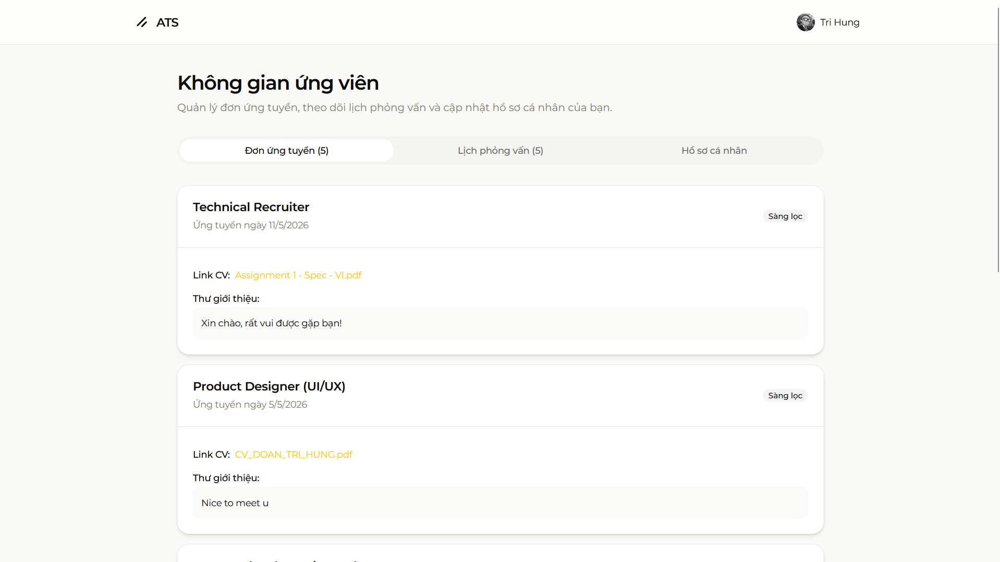
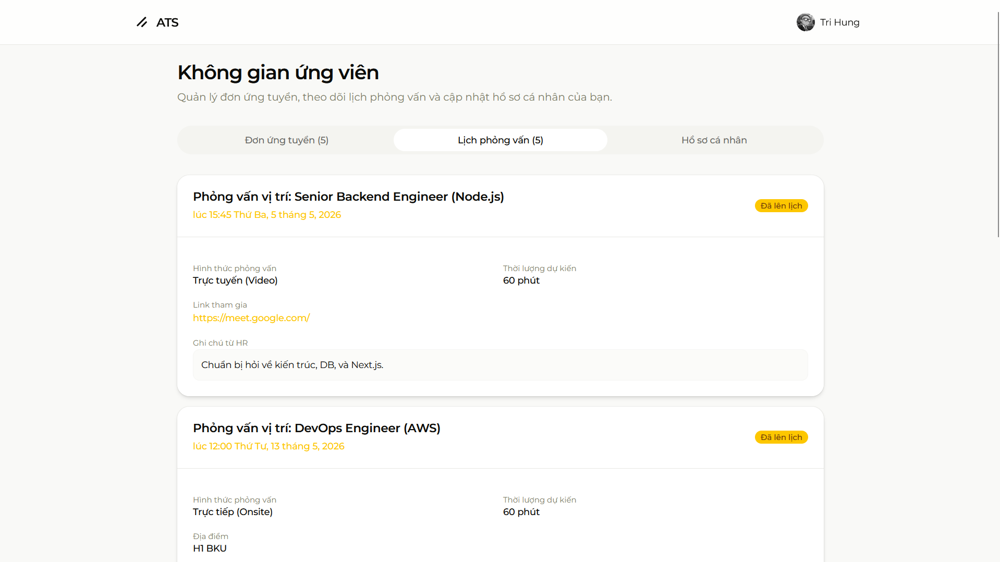
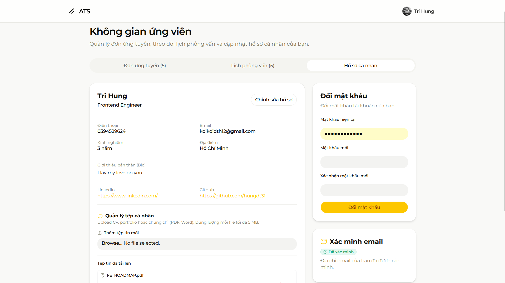

# Module C - Khu vực của Ứng viên (Candidate)

**Người phụ trách:** Nguyễn Quang Sáng

## Mục lục

1. [Sheet 01 - Khái quát chức năng](#sheet-01)
2. [Sheet 02 - IPO](#sheet-02)
3. [Sheet 03 - IPO Chi tiết](#sheet-03)
4. [Sheet 04 - Chi tiết điều khiển](#sheet-04)
5. [Sheet 05 - Giao diện màn hình](#sheet-05)
6. [Sheet 06 - Thông báo](#sheet-06)
7. [Sheet 07 - API](#sheet-07)
8. [Sheet 08 - Request](#sheet-08)
9. [Sheet 09 - Response](#sheet-09)
10. [Sheet 10 - SQL](#sheet-10)
11. [Lịch sử thay đổi](#lich-su-thay-doi)

---

<a id="sheet-01"></a>
## Sheet 01 - Khái quát chức năng

### 1. Khái quát chức năng

Toàn bộ khu vực ứng viên tập trung tại **một trang duy nhất** `/candidate` với bố cục **3 Tab**:

| No | Tab | Tên hiển thị | Mô tả |
|---:|---|---|---|
| 1 | `applications` | Đơn ứng tuyển | Danh sách đơn đã nộp, trạng thái, link CV, thư giới thiệu |
| 2 | `interviews` | Lịch phỏng vấn | Danh sách lịch PV được HR lên lịch, ngày giờ, hình thức, link tham gia |
| 3 | `profile` | Hồ sơ cá nhân | Xem/chỉnh sửa thông tin cá nhân; đổi mật khẩu; xác minh email OTP; quản lý file CV |

> **Ghi chú:** Không có sub-route. Tất cả chức năng nằm trong `app/candidate/page.tsx` kết hợp 3 component con.

### 2. Danh sách table sử dụng

| No | Table | Create | Read | Update | Delete | Ghi chú |
|---:|---|---|---|---|---|---|
| 1 | `users` | - | x | x | - | Đọc thông tin cơ bản; cập nhật fullName, email, phone; refresh JWT sau update |
| 2 | `candidate_profiles` | x | x | x | - | UPSERT hồ sơ; tạo mới nếu chưa có |
| 3 | `applications` | - | x | - | - | Đọc danh sách đơn đã nộp theo candidate_id |
| 4 | `jobs` | - | x | - | - | JOIN để lấy title, slug của job trong đơn |
| 5 | `interviews` | - | x | - | - | Đọc lịch PV WHERE applications.candidate_id = current user |
| 6 | `files` | x | x | x | x | Upload (via Appwrite), đổi tên, xóa file CV |
| 7 | `otp_tokens` | x | x | x | - | Gửi/xác thực OTP xác minh email |

### 3. Đối tượng / Bộ phận sử dụng

| Vai trò | Quyền truy cập |
|---|---|
| Candidate (đã đăng nhập) | Toàn bộ chức năng Module C |
| Guest / HR / Admin / Interviewer | Không có quyền — redirect hoặc 401 |

> Middleware kiểm tra `role = candidate` trên tất cả request `/api/candidate/*`.

---

<a id="sheet-02"></a>
## Sheet 02 - IPO

### 1. Danh sách nhóm chức năng

| No | Nhóm chức năng | Tab liên quan | Mô tả |
|---:|---|---|---|
| 1 | Xem danh sách đơn ứng tuyển | Đơn ứng tuyển | Tải applications + jobs.slug, jobs.title theo candidate |
| 2 | Xem lịch phỏng vấn | Lịch phỏng vấn | Tải interviews (JOIN applications → jobs) theo candidate |
| 3 | Xem hồ sơ cá nhân | Hồ sơ cá nhân | Đọc users + candidate_profiles |
| 4 | Chỉnh sửa hồ sơ | Hồ sơ cá nhân | Update users + UPSERT candidate_profiles; làm mới JWT |
| 5 | Đổi mật khẩu | Hồ sơ cá nhân | Verify bcrypt mật khẩu cũ → hash mới → lưu DB |
| 6 | Xác minh email qua OTP | Hồ sơ cá nhân | Gửi OTP → người dùng nhập 6 chữ số → đánh dấu email_verified = true |
| 7 | Quản lý file cá nhân | Hồ sơ cá nhân | Upload lên Appwrite → lưu metadata vào `files`; đổi tên; xóa |

### 2. Nhóm 1 — Xem danh sách đơn ứng tuyển

| Thành phần | Nội dung |
|---|---|
| **Input** | JWT session cookie; không có query param |
| **Process** | `prisma.applications.findMany` WHERE `candidate_id = session.user.id`; JOIN `jobs` lấy `id, slug, title, location, department, employment_type`; ORDER BY `applied_at DESC` |
| **Output** | `{ applications: [...] }` — mỗi item có status badge, link CV, cover letter, link `/jobs/[slug]` |

### 3. Nhóm 2 — Xem lịch phỏng vấn

| Thành phần | Nội dung |
|---|---|
| **Input** | JWT session cookie |
| **Process** | `prisma.interviews.findMany` WHERE `applications.candidate_id = session.user.id`; JOIN `applications.jobs` lấy `id, slug, title`; ORDER BY `scheduled_at ASC` |
| **Output** | `{ interviews: [...] }` — mỗi item có scheduled_at (format vi-VN), type, status, meeting_link, location, notes |

### 4. Nhóm 3 — Xem hồ sơ cá nhân

| Thành phần | Nội dung |
|---|---|
| **Input** | JWT session cookie |
| **Process** | `prisma.user.findUnique` WHERE `id = session.user.id` INCLUDE `candidate_profiles` |
| **Output** | `{ id, email, fullName, phone, emailVerified, profile: candidate_profiles \| null }` |

### 5. Nhóm 4 — Chỉnh sửa hồ sơ

| Thành phần | Nội dung |
|---|---|
| **Input** | JWT; body: `{ email, fullName, phone, title, bio, location, years_experience, linkedin_url, github_url }` |
| **Process** | `prisma.user.update` (email, fullName, phone); `prisma.candidate_profiles.upsert` (toàn bộ fields profile); `signSessionToken` với thông tin mới → set cookie mới |
| **Output** | `{ success: true, data: { profile } }` + Set-Cookie JWT mới |

### 6. Nhóm 5 — Đổi mật khẩu

| Thành phần | Nội dung |
|---|---|
| **Input** | JWT; body: `{ currentPassword, newPassword }` |
| **Process** | Lấy `passwordHash` từ DB; `bcrypt.compare(currentPassword, hash)`; nếu đúng → `bcrypt.hash(newPassword, 12)` → UPDATE users |
| **Output** | `{ success: true }` hoặc 401 nếu mật khẩu cũ sai |

### 7. Nhóm 6 — Xác minh email OTP

| Thành phần | Nội dung |
|---|---|
| **Input (gửi OTP)** | JWT; body: `{ email, type: "email_verify" }` → `POST /api/auth/otp/send` |
| **Input (xác thực)** | body: `{ email, code }` (code = 6 chữ số) → `POST /api/auth/otp/verify-email` |
| **Process gửi** | Tạo record `otp_tokens`; gửi email qua Resend; cooldown 60s |
| **Process xác thực** | Kiểm tra code, expiresAt, usedAt; UPDATE `users.email_verified = true`; đánh dấu OTP đã dùng |
| **Output** | `{ success: true }` + reload trang để cập nhật badge |

### 8. Nhóm 7 — Quản lý file cá nhân

| Thành phần | Nội dung |
|---|---|
| **Upload** | Client validate kích thước ≤ 5 MB và định dạng `.pdf/.doc/.docx`; `storage.createFile(BUCKET_ID, ID.unique(), file)` lên Appwrite; POST `/api/candidate/files` lưu metadata (file_name, file_url, file_type, appwrite_id) |
| **Đổi tên** | PUT `/api/candidate/files/[id]` body: `{ file_name }` → UPDATE `files.file_name` |
| **Xóa** | DELETE `/api/candidate/files/[id]` → `prisma.files.delete` (Appwrite file giữ nguyên — chỉ xóa DB record) |
| **Output** | Danh sách `files` của user; toast success/error |

---

<a id="sheet-03"></a>
## Sheet 03 - IPO Chi tiết

### Danh sách method

| No | Method | API | Mô tả | Auth |
|---:|---|---|---|---|
| C-01 | GET | `/api/candidate/applications` | Danh sách đơn ứng tuyển | candidate |
| C-02 | GET | `/api/candidate/interviews` | Danh sách lịch phỏng vấn | candidate |
| C-03 | GET | `/api/candidate/profile` | Đọc hồ sơ + user info | candidate |
| C-04 | POST | `/api/candidate/profile` | Cập nhật hồ sơ + refresh JWT | candidate |
| C-05 | PATCH | `/api/auth/password` | Đổi mật khẩu | candidate/any |
| C-06 | POST | `/api/auth/otp/send` | Gửi OTP xác minh email | - |
| C-07 | POST | `/api/auth/otp/verify-email` | Xác thực OTP | - |
| C-08 | GET | `/api/candidate/files` | Danh sách file cá nhân | candidate |
| C-09 | POST | `/api/candidate/files` | Lưu metadata file vào DB | candidate |
| C-10 | PUT | `/api/candidate/files/[id]` | Đổi tên file | candidate |
| C-11 | DELETE | `/api/candidate/files/[id]` | Xóa file khỏi DB | candidate |

### Chi tiết C-01: GET /api/candidate/applications

```
WHERE candidate_id = session.user.id
INCLUDE jobs { id, slug, title, location, department, employment_type }
ORDER BY applied_at DESC
```

### Chi tiết C-02: GET /api/candidate/interviews

```
WHERE applications.candidate_id = session.user.id
INCLUDE applications {
  INCLUDE jobs { id, slug, title }
}
ORDER BY scheduled_at ASC
```

### Chi tiết C-03: GET /api/candidate/profile

```
findUnique users WHERE id = session.user.id
INCLUDE candidate_profiles
RETURN { id, email, fullName, phone, emailVerified, profile }
```

### Chi tiết C-04: POST /api/candidate/profile

```
UPDATE users SET email, fullName, phone WHERE id = session.user.id
UPSERT candidate_profiles WHERE user_id = session.user.id
signSessionToken({ userId, email, fullName, role })
SET-COOKIE session_token (mới)
```

---

<a id="sheet-04"></a>
## Sheet 04 - Chi tiết điều khiển

### Trang `/candidate` — Header

| No | Tên control | Loại | I/O | Ghi chú |
|---:|---|---|---|---|
| 1 | Tiêu đề "Không gian ứng viên" | TEXT | O | H1 cố định |
| 2 | Mô tả | TEXT | O | "Quản lý đơn ứng tuyển, theo dõi lịch phỏng vấn..." |
| 3 | TabsList | TAB_GROUP | I | 3 tab: applications / interviews / profile |
| 4 | Tab "Đơn ứng tuyển (N)" | TAB | I | N = số lượng applications; mặc định active |
| 5 | Tab "Lịch phỏng vấn (N)" | TAB | I | N = số lượng interviews |
| 6 | Tab "Hồ sơ cá nhân" | TAB | I | Không hiện số |

### Tab 1 — Đơn ứng tuyển

| No | Tên control | Loại | I/O | Ghi chú |
|---:|---|---|---|---|
| 1 | Danh sách Card đơn | CARD_LIST | O | Mỗi card: tên vị trí (link /jobs/[slug]), ngày ứng tuyển, badge status |
| 2 | Badge trạng thái | BADGE | O | applied=outline, screening=secondary, interviewing=default, offered=default, hired=default, rejected=destructive |
| 3 | Link tên vị trí | LINK | O | href="/jobs/{jobs.slug}" |
| 4 | Link CV | LINK | O | href={cv_file_url} target="_blank"; hiển thị cv_filename nếu có |
| 5 | Cover letter | TEXT | O | Hiển thị trong box nền muted nếu có |
| 6 | Empty state | TEXT | O | "Bạn chưa gửi đơn ứng tuyển nào. Xem danh sách việc làm" + link /jobs |
| 7 | Loading state | TEXT | O | Animate-pulse "Đang tải danh sách đơn ứng tuyển..." |

### Tab 2 — Lịch phỏng vấn

| No | Tên control | Loại | I/O | Ghi chú |
|---:|---|---|---|---|
| 1 | Danh sách Card PV | CARD_LIST | O | Mỗi card: "Phỏng vấn vị trí: [link job]", thời gian (vi-VN full), badge status |
| 2 | Badge trạng thái PV | BADGE | O | scheduled=default, completed=secondary, cancelled=destructive |
| 3 | Hình thức PV | TEXT | O | video→"Trực tuyến (Video)", phone→"Gọi điện thoại", onsite→"Trực tiếp (Onsite)", technical→giữ nguyên |
| 4 | Thời lượng | TEXT | O | "{duration_minutes} phút" |
| 5 | Link họp | LINK | O | Hiển thị nếu meeting_link != null |
| 6 | Địa điểm | TEXT | O | Hiển thị nếu location != null |
| 7 | Ghi chú HR | TEXT | O | Box nền muted nếu notes != null |
| 8 | Empty state | TEXT | O | "Bạn hiện chưa có lịch phỏng vấn nào." |

### Tab 3 — Hồ sơ cá nhân (view mode, cột trái)

| No | Tên control | Loại | I/O | Ghi chú |
|---:|---|---|---|---|
| 1 | Tên đầy đủ (H2) | TEXT | O | Từ users.fullName |
| 2 | Tiêu đề vị trí | TEXT | O | candidate_profiles.title |
| 3 | Nút "Chỉnh sửa hồ sơ" | BUTTON | I | Chuyển sang edit mode |
| 4 | Grid thông tin: Điện thoại, Email, Kinh nghiệm, Địa điểm | TEXT | O | 2 cột |
| 5 | Bio (giới thiệu bản thân) | TEXT | O | whitespace-pre-wrap |
| 6 | LinkedIn URL | LINK | O | target="_blank" |
| 7 | GitHub URL | LINK | O | target="_blank" |
| 8 | Section "Quản lý tệp cá nhân" | SECTION | I/O | Upload + danh sách file |
| 9 | Input upload file | INPUT_FILE | I | accept=".pdf,.doc,.docx"; validate ≤5MB trước upload |
| 10 | Danh sách file đã upload | LIST | O | Mỗi item: tên file (link), nút Sửa tên, nút Xóa |
| 11 | Inline rename | INPUT + BUTTONS | I | Input tên mới + Lưu / Hủy |
| 12 | Loading files | TEXT | O | Animate-pulse khi tải |

### Tab 3 — Hồ sơ cá nhân (edit mode, cột trái)

| No | Tên control | Loại | I/O | Check nhập | Ghi chú |
|---:|---|---|---|---|---|
| 1 | Họ và tên | INPUT TEXT | I | Bắt buộc (required) | Bind → users.fullName |
| 2 | Email | INPUT EMAIL | I | Bắt buộc, format email | Bind → users.email |
| 3 | Điện thoại | INPUT TEL | I | Tùy chọn | Bind → users.phone |
| 4 | Tiêu đề (vị trí) | INPUT TEXT | I | Tùy chọn | Bind → candidate_profiles.title |
| 5 | Kinh nghiệm (năm) | INPUT NUMBER | I | min=0 | Bind → years_experience |
| 6 | Địa điểm | INPUT TEXT | I | Tùy chọn | Bind → location |
| 7 | Bio | TEXTAREA | I | Tùy chọn | Bind → bio |
| 8 | LinkedIn URL | INPUT URL | I | Tùy chọn | Bind → linkedin_url |
| 9 | GitHub URL | INPUT URL | I | Tùy chọn | Bind → github_url |
| 10 | Nút Hủy | BUTTON | I | - | setIsEditMode(false) |
| 11 | Nút Lưu thay đổi | BUTTON SUBMIT | I | Form hợp lệ | disabled khi isPending |

### Tab 3 — Hồ sơ cá nhân (cột phải)

| No | Tên control | Loại | I/O | Check nhập | Ghi chú |
|---:|---|---|---|---|---|
| 1 | Mật khẩu hiện tại | INPUT PASSWORD | I | Bắt buộc | |
| 2 | Mật khẩu mới | INPUT PASSWORD | I | Bắt buộc, min 8 ký tự | |
| 3 | Xác nhận mật khẩu mới | INPUT PASSWORD | I | Bắt buộc, phải khớp newPassword | |
| 4 | Nút "Đổi mật khẩu" | BUTTON SUBMIT | I | Form hợp lệ | disabled khi isPending |
| 5 | Badge xác minh email | BADGE | O | - | Đã xác minh=xanh / Chưa xác minh=vàng |
| 6 | Nút "Gửi mã OTP" | BUTTON | I | Chỉ hiện khi chưa xác minh | Cooldown 60s sau khi gửi |
| 7 | InputOTP (6 ô số) | OTP_INPUT | I | Chỉ số, length=6 | Hiển thị sau khi gửi OTP |
| 8 | Nút "Xác minh email" | BUTTON | I | otpCode.length = 6 | disabled khi isPending hoặc code chưa đủ |
| 9 | Nút "Gửi lại mã" | BUTTON TEXT | I | disabled khi cooldown > 0 | Hiện "{N}s" đếm ngược |

---

<a id="sheet-05"></a>
## Sheet 05 - Giao diện màn hình

### 1. Danh sách màn hình

| No | Tên màn hình | Route / URL | Loại | Khái quát |
|---:|---|---|---|---|
| 1 | Không gian ứng viên | `/candidate` | Single-page + 3 Tabs | Tất cả chức năng ứng viên tập trung tại đây |

> Không có sub-route. Mọi chức năng đều là Tab hoặc mode (view/edit) trong cùng trang.

### 2. Màn hình `/candidate`







| Field | Nội dung |
|---|---|
| Route / URL | `/candidate` |
| Tên màn hình | Không gian ứng viên |
| Loại màn hình | Dashboard — 3 Tab |
| Điều kiện hiển thị | User đã đăng nhập, `role = candidate` |
| Redirect nếu chưa đăng nhập | `/login?callbackUrl=/candidate` |
| Redirect nếu sai role | `/unauthorized` |
| Default tab | `applications` |
| Liên kết API | C-01, C-02, C-03, C-04, C-05, C-06, C-07, C-08, C-09, C-10, C-11 |
| Ghi chú kỹ thuật | Client Component; React Query; `useMe()` lấy user hiện tại cho SiteHeader |

### 3. Rule hiển thị theo trạng thái

| No | Trường hợp | Điều kiện | Hiển thị |
|---:|---|---|---|
| 1 | Loading đơn ứng tuyển | `isAppsLoading = true` | Animate-pulse text |
| 2 | Không có đơn | `applications.length = 0` | Empty state + link /jobs |
| 3 | Có đơn | `applications.length > 0` | Grid card danh sách |
| 4 | Loading lịch PV | `isInterviewsLoading = true` | Animate-pulse text |
| 5 | Không có lịch PV | `interviews.length = 0` | Empty state |
| 6 | Có lịch PV | `interviews.length > 0` | Grid card danh sách |
| 7 | Hồ sơ đang tải | `isProfileLoading = true` | Animate-pulse text |
| 8 | Hồ sơ view mode | `isEditMode = false` | Card thông tin + tệp |
| 9 | Hồ sơ edit mode | `isEditMode = true` | Form chỉnh sửa |
| 10 | Email đã xác minh | `emailVerified = true` | Badge xanh; ẩn form OTP |
| 11 | Email chưa xác minh | `emailVerified = false` | Badge vàng; hiện form gửi OTP |
| 12 | Đang upload file | `isFilesUploading = true` | Animate-pulse + input disabled |
| 13 | File vượt 5MB | client-side check | Toast error; không upload Appwrite |

### 4. Rule validation hồ sơ (edit mode)

| No | Field | Validation | Lỗi hiển thị | Hành vi |
|---:|---|---|---|---|
| 1 | Họ và tên | Bắt buộc (required) | HTML5 native | Block submit |
| 2 | Email | Bắt buộc, format email | HTML5 native | Block submit |
| 3 | Kinh nghiệm | min=0, number | HTML5 native | Block submit nếu âm |

### 5. Rule validation đổi mật khẩu

| No | Field | Validation | Hành vi |
|---:|---|---|---|
| 1 | Mật khẩu hiện tại | Bắt buộc | Block submit |
| 2 | Mật khẩu mới | Bắt buộc | Block submit |
| 3 | Xác nhận mật khẩu | Phải khớp với mật khẩu mới | Toast/msg lỗi — hook `useChangePassword` xử lý |
| 4 | Mật khẩu cũ sai | bcrypt.compare thất bại | API 401 → Toast lỗi "Mật khẩu hiện tại không đúng" |

### 6. Rule validation OTP

| No | Điều kiện | Hành vi |
|---:|---|---|
| 1 | otpCode.length < 6 | Nút "Xác minh email" disabled |
| 2 | OTP hết hạn | API trả lỗi → msg lỗi |
| 3 | OTP đã dùng | API trả lỗi → msg lỗi |
| 4 | Cooldown 60s đang chạy | Nút "Gửi lại mã" disabled; hiển thị đếm ngược |

---

<a id="sheet-06"></a>
## Sheet 06 - Thông báo

| MessageCD | Loại | Nội dung (tiếng Việt) | Khi nào |
|---|---|---|---|
| C-SUC-001 | Success | Lưu hồ sơ thành công. | POST /api/candidate/profile 200 |
| C-SUC-002 | Success | Đổi mật khẩu thành công. | PATCH /api/auth/password 200 |
| C-SUC-003 | Success | Mã OTP đã được gửi đến email của bạn. | POST /api/auth/otp/send 200 |
| C-SUC-004 | Success | Xác minh email thành công! | POST /api/auth/otp/verify-email 200 |
| C-SUC-005 | Success | Tải tệp lên thành công. | POST /api/candidate/files 201 |
| C-SUC-006 | Success | Đổi tên tệp thành công. | PUT /api/candidate/files/[id] 200 |
| C-SUC-007 | Success | Xóa tệp thành công. | DELETE /api/candidate/files/[id] 200 |
| C-ERR-001 | Error | Không thể cập nhật hồ sơ. Vui lòng thử lại. | POST profile lỗi 500 |
| C-ERR-002 | Error | Mật khẩu hiện tại không đúng. | PATCH password 401 |
| C-ERR-003 | Error | Gửi mã thất bại, vui lòng thử lại. | POST otp/send lỗi |
| C-ERR-004 | Error | Xác minh thất bại, vui lòng thử lại. | POST otp/verify-email lỗi |
| C-ERR-005 | Error | Dung lượng file vượt quá 5 MB. Vui lòng chọn file nhỏ hơn hoặc nén tài liệu. | Client-side size check |
| C-ERR-006 | Error | Cấu hình Appwrite chưa đầy đủ trong file .env | env vars missing |
| C-ERR-007 | Error | Không thể lưu tệp vào hệ thống. | POST /api/candidate/files lỗi |
| C-ERR-008 | Error | Không thể đổi tên tệp. | PUT files/[id] lỗi |
| C-ERR-009 | Error | Không thể xóa tệp. | DELETE files/[id] lỗi |
| C-WARN-001 | Warning | Bạn chưa xác minh email. Một số tính năng có thể bị hạn chế. | emailVerified = false |

---

<a id="sheet-07"></a>
## Sheet 07 - API

### 1. Danh sách API

| No | Method | Endpoint | Mô tả | Role | Status thành công |
|---:|---|---|---|---|---|
| C-01 | GET | `/api/candidate/applications` | Danh sách đơn ứng tuyển | candidate | 200 |
| C-02 | GET | `/api/candidate/interviews` | Danh sách lịch phỏng vấn | candidate | 200 |
| C-03 | GET | `/api/candidate/profile` | Thông tin hồ sơ + user | candidate | 200 |
| C-04 | POST | `/api/candidate/profile` | Cập nhật hồ sơ, refresh JWT | candidate | 200 |
| C-05 | PATCH | `/api/auth/password` | Đổi mật khẩu | any (authenticated) | 200 |
| C-06 | POST | `/api/auth/otp/send` | Gửi OTP email | - | 200 |
| C-07 | POST | `/api/auth/otp/verify-email` | Xác thực OTP | - | 200 |
| C-08 | GET | `/api/candidate/files` | Danh sách file | candidate | 200 |
| C-09 | POST | `/api/candidate/files` | Lưu metadata file | candidate | 201 |
| C-10 | PUT | `/api/candidate/files/[id]` | Đổi tên file | candidate | 200 |
| C-11 | DELETE | `/api/candidate/files/[id]` | Xóa file | candidate | 200 |

### 2. Chi tiết phân quyền

Tất cả `/api/candidate/*` đều kiểm tra:
```
if (!session || session.user.role !== "candidate") → 401
```

---

<a id="sheet-08"></a>
## Sheet 08 - Request

### C-04: POST /api/candidate/profile

```json
{
  "fullName": "Nguyễn Văn A",
  "email": "vana@email.com",
  "phone": "0901234567",
  "title": "Frontend Developer",
  "bio": "Lập trình viên với 3 năm kinh nghiệm...",
  "location": "TP. Hồ Chí Minh",
  "years_experience": 3,
  "linkedin_url": "https://linkedin.com/in/vana",
  "github_url": "https://github.com/vana"
}
```

> Tất cả field đều optional (chỉ cập nhật field có giá trị). `null` để xóa field.

### C-05: PATCH /api/auth/password

```json
{
  "currentPassword": "OldPass@123",
  "newPassword": "NewPass@456"
}
```

### C-06: POST /api/auth/otp/send

```json
{
  "email": "vana@email.com",
  "type": "email_verify"
}
```

### C-07: POST /api/auth/otp/verify-email

```json
{
  "email": "vana@email.com",
  "code": "123456"
}
```

### C-09: POST /api/candidate/files

```json
{
  "file_name": "CV_NguyenVanA_2026.pdf",
  "file_url": "https://cloud.appwrite.io/v1/storage/buckets/.../files/.../view?project=...",
  "file_type": "cv",
  "appwrite_id": "abc123xyz"
}
```

### C-10: PUT /api/candidate/files/[id]

```json
{
  "file_name": "CV_NguyenVanA_Updated.pdf"
}
```

---

<a id="sheet-09"></a>
## Sheet 09 - Response

### C-01: GET /api/candidate/applications — 200

```json
{
  "success": true,
  "data": {
    "applications": [
      {
        "id": "uuid",
        "job_id": "uuid",
        "candidate_id": "uuid",
        "cv_file_url": "https://...",
        "cv_filename": "CV_2026.pdf",
        "cover_letter": "Kính gửi...",
        "status": "screening",
        "source_channel": "website",
        "applied_at": "2026-05-01T10:00:00.000Z",
        "jobs": {
          "id": "uuid",
          "slug": "senior-frontend-developer",
          "title": "Senior Frontend Developer",
          "location": "TP. Hồ Chí Minh",
          "department": "Kỹ thuật",
          "employment_type": "full_time"
        }
      }
    ]
  }
}
```

### C-02: GET /api/candidate/interviews — 200

```json
{
  "success": true,
  "data": {
    "interviews": [
      {
        "id": "uuid",
        "application_id": "uuid",
        "interviewer_id": "uuid",
        "scheduled_at": "2026-05-20T09:00:00.000Z",
        "duration_minutes": 60,
        "type": "video",
        "status": "scheduled",
        "meeting_link": "https://meet.google.com/xxx",
        "location": null,
        "notes": "Chuẩn bị bài toán thuật toán",
        "applications": {
          "jobs": {
            "id": "uuid",
            "slug": "senior-frontend-developer",
            "title": "Senior Frontend Developer"
          }
        }
      }
    ]
  }
}
```

### C-03: GET /api/candidate/profile — 200

```json
{
  "success": true,
  "data": {
    "id": "uuid",
    "email": "vana@email.com",
    "fullName": "Nguyễn Văn A",
    "phone": "0901234567",
    "emailVerified": true,
    "profile": {
      "id": "uuid",
      "user_id": "uuid",
      "title": "Frontend Developer",
      "bio": "Lập trình viên 3 năm kinh nghiệm...",
      "location": "TP. Hồ Chí Minh",
      "years_experience": 3,
      "skills": null,
      "education": null,
      "linkedin_url": "https://linkedin.com/in/vana",
      "github_url": "https://github.com/vana",
      "created_at": "2026-01-01T00:00:00.000Z",
      "updated_at": "2026-05-17T08:00:00.000Z"
    }
  }
}
```

### C-08: GET /api/candidate/files — 200

```json
{
  "success": true,
  "data": {
    "files": [
      {
        "id": "uuid",
        "file_name": "CV_NguyenVanA_2026.pdf",
        "file_url": "https://cloud.appwrite.io/...",
        "file_type": "cv",
        "appwrite_id": "abc123xyz"
      }
    ]
  }
}
```

### Lỗi chung

```json
{ "success": false, "error": "Mô tả lỗi" }
```

| Status | Trường hợp |
|---|---|
| 401 | Chưa đăng nhập hoặc role không phải candidate |
| 401 | Mật khẩu hiện tại sai (C-05) |
| 404 | File/user không tồn tại |
| 500 | Lỗi DB hoặc Appwrite |

---

<a id="sheet-10"></a>
## Sheet 10 - SQL

### users (cập nhật)

```sql
UPDATE users
SET
  email        = :email,
  full_name    = :fullName,
  phone        = :phone,
  updated_at   = NOW()
WHERE id = :candidateId;
```

### candidate_profiles (UPSERT)

```sql
INSERT INTO candidate_profiles
  (id, user_id, title, bio, location, years_experience, linkedin_url, github_url)
VALUES
  (UUID(), :userId, :title, :bio, :location, :years_experience, :linkedin_url, :github_url)
ON DUPLICATE KEY UPDATE
  title              = :title,
  bio                = :bio,
  location           = :location,
  years_experience   = :years_experience,
  linkedin_url       = :linkedin_url,
  github_url         = :github_url,
  updated_at         = NOW();
```

### applications (read)

```sql
SELECT
  a.*,
  j.id      AS job_id,
  j.slug    AS job_slug,
  j.title   AS job_title,
  j.location,
  j.department,
  j.employment_type
FROM applications a
  JOIN jobs j ON j.id = a.job_id
WHERE a.candidate_id = :candidateId
ORDER BY a.applied_at DESC;
```

### interviews (read)

```sql
SELECT
  i.*,
  j.id     AS job_id,
  j.slug   AS job_slug,
  j.title  AS job_title
FROM interviews i
  JOIN applications a ON a.id = i.application_id
  JOIN jobs j         ON j.id = a.job_id
WHERE a.candidate_id = :candidateId
ORDER BY i.scheduled_at ASC;
```

### files (CRUD)

```sql
-- Insert
INSERT INTO files (id, user_id, file_name, file_url, file_type, appwrite_id)
VALUES (UUID(), :userId, :fileName, :fileUrl, :fileType, :appwriteId);

-- Read
SELECT * FROM files WHERE user_id = :userId ORDER BY created_at DESC;

-- Rename
UPDATE files SET file_name = :newName, updated_at = NOW() WHERE id = :fileId AND user_id = :userId;

-- Delete
DELETE FROM files WHERE id = :fileId AND user_id = :userId;
```

### users — đổi mật khẩu

```sql
UPDATE users
SET password_hash = :newHash,
    updated_at    = NOW()
WHERE id = :userId;
```

### users — xác minh email

```sql
UPDATE users
SET email_verified = TRUE,
    updated_at     = NOW()
WHERE id = :userId;

UPDATE otp_tokens
SET used_at = NOW()
WHERE id = :otpId;
```

---

<a id="lich-su-thay-doi"></a>
## 11. Lịch sử thay đổi

| Phiên bản | Ngày | Người thay đổi | Nội dung |
|---|---|---|---|
| 1.0 | 2026-05-17 | AI Agent | Khởi tạo tài liệu lần đầu (generate từ prompt template) |
| 1.1 | 2026-05-17 | AI Agent | Viết lại theo source code thực tế: 1 route `/candidate` + 3 Tab (Đơn ứng tuyển / Lịch phỏng vấn / Hồ sơ cá nhân); bỏ các sub-route không tồn tại; thêm chi tiết file upload, đổi mật khẩu, xác minh email OTP; cập nhật response shape với `jobs.slug` |
