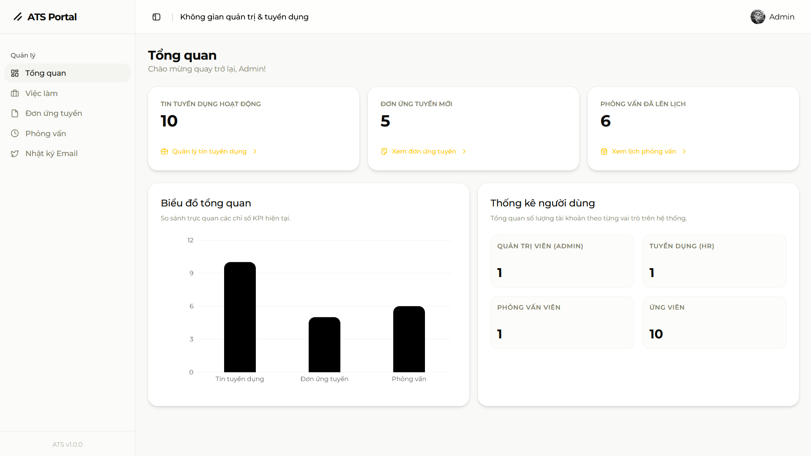
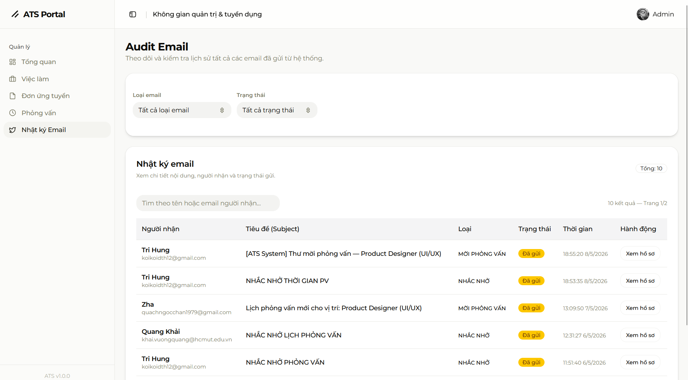

# Module D - Dashboard

**Người phụ trách:** Trương Minh Nguyên

## Mục lục

1. [Sheet 01 - Khái quát chức năng](#sheet-01)
2. [Sheet 02 - IPO](#sheet-02)
3. [Sheet 03 - IPO Chi tiết](#sheet-03)
4. [Sheet 04 - Chi tiết điều khiển](#sheet-04)
5. [Sheet 05 - Giao diện màn hình](#sheet-05)
6. [Sheet 06 - Thông báo](#sheet-06)
7. [Sheet 07 - API](#sheet-07)
8. [Sheet 08 - Request](#sheet-08)
9. [Sheet 09 - Response](#sheet-09)
10. [Sheet 10 - SQL](#sheet-10)
11. [Lịch sử thay đổi](#lich-su-thay-doi)

---

<a id="sheet-01"></a>
## Sheet 01 - Khái quát chức năng

### 1. Khái quát chức năng

| No | Nội dung |
|---:|---|
| 1 | Hiển thị tổng quan hệ thống tuyển dụng: số tin tuyển dụng đang active, số hồ sơ mới, số lịch phỏng vấn hôm nay, số ứng viên đã được tuyển. |
| 2 | Hiển thị biểu đồ xu hướng ứng tuyển theo thời gian (tuần/tháng). |
| 3 | Hiển thị biểu đồ phân phối hồ sơ theo trạng thái (applied/screening/interviewing/offered/hired/rejected). |
| 4 | Quản lý nhật ký email toàn hệ thống: xem lịch sử email đã gửi cho ứng viên, lọc theo loại và trạng thái. |
| 5 | Truy cập nhanh đến các module khác (Jobs, Applications, Interviews) từ dashboard. |

### 2. Danh sách table sử dụng

| No | Table | Create | Read | Update | Delete | Ghi chú |
|---:|---|---|---|---|---|---|
| 1 | jobs | - | x | - | - | Đếm jobs active |
| 2 | applications | - | x | - | - | Đếm hồ sơ mới, thống kê trạng thái |
| 3 | interviews | - | x | - | - | Đếm lịch PV hôm nay |
| 4 | email_logs | - | x | - | - | Nhật ký email |
| 5 | users | - | x | - | - | Thông tin người gửi/nhận email |

### 3. Đối tượng / Bộ phận sử dụng

| Đối tượng | Xem KPI | Xem biểu đồ | Xem nhật ký email | Ghi chú |
|---|---|---|---|---|
| Guest | - | - | - | Không có quyền |
| Candidate | - | - | - | Không có quyền vào /dashboard |
| HR | x | x | x | Toàn quyền dashboard |
| Admin | x | x | x | Toàn quyền dashboard |
| Interviewer | - | - | - | Không có quyền vào dashboard KPI |

---

<a id="sheet-02"></a>
## Sheet 02 - IPO

### 1. Danh sách nhóm chức năng

| No | Nhóm chức năng | Mô tả |
|---:|---|---|
| 1 | Hiển thị KPI tổng quan | Tính toán và hiển thị 4 chỉ số KPI chính của hệ thống |
| 2 | Biểu đồ xu hướng ứng tuyển | Thống kê số lượng hồ sơ theo thời gian |
| 3 | Biểu đồ phân phối trạng thái | Phân phối hồ sơ theo từng trạng thái pipeline |
| 4 | Nhật ký email hệ thống | Xem và lọc toàn bộ email đã gửi trong hệ thống |
| 5 | Điều hướng nhanh | Truy cập nhanh đến các module khác |

### 2. Nhóm 1 - Hiển thị KPI tổng quan

**Chức năng cấu tạo:**
- Đếm số jobs có status = `active`
- Đếm số applications mới trong 7 ngày gần nhất
- Đếm số interviews có scheduled_at là hôm nay và status = `scheduled`
- Đếm số applications có status = `hired`

| Thành phần | Nội dung |
|---|---|
| **Input** | JWT session (role: hr/admin), query params (không có) |
| **Process** | Truy vấn database đếm theo điều kiện tương ứng; tổng hợp 4 giá trị KPI |
| **Output** | Object: `{ activeJobs, newApplications, todayInterviews, hiredCount }` |

### 3. Nhóm 2 - Biểu đồ xu hướng ứng tuyển

**Chức năng cấu tạo:**
- Nhóm applications theo ngày trong khoảng thời gian chọn (mặc định 30 ngày)
- Trả về mảng `[{ date, count }]` để render line chart

| Thành phần | Nội dung |
|---|---|
| **Input** | JWT session, query params: `range` (7d/30d/90d) |
| **Process** | GROUP BY ngày applied_at trong khoảng range; fill ngày không có hồ sơ bằng 0 |
| **Output** | Array: `[{ date: "2026-05-01", count: 3 }, ...]` |

### 4. Nhóm 3 - Biểu đồ phân phối trạng thái

**Chức năng cấu tạo:**
- Group applications theo status
- Trả về mảng `[{ status, count }]` để render pie/donut chart

| Thành phần | Nội dung |
|---|---|
| **Input** | JWT session |
| **Process** | GROUP BY status trong bảng applications; ánh xạ sang label tiếng Việt |
| **Output** | Array: `[{ status: "applied", label: "Đã nộp", count: 12 }, ...]` |

### 5. Nhóm 4 - Nhật ký email hệ thống

**Chức năng cấu tạo:**
- Liệt kê email_logs với thông tin ứng viên và người gửi
- Lọc theo type (invite/result/reminder/rejection/offer) và status (pending/sent/failed)
- Phân trang

| Thành phần | Nội dung |
|---|---|
| **Input** | JWT session, query: `type`, `status`, `page`, `limit` |
| **Process** | JOIN email_logs với users (recipient, sender); áp dụng filter; phân trang |
| **Output** | `{ data: [...], total, page, limit }` |

---

<a id="sheet-03"></a>
## Sheet 03 - IPO Chi tiết

### Danh sách method

| No | Method | Nhóm | Mô tả |
|---:|---|---|---|
| 1 | `GET /api/dashboard` | KPI + Charts | Lấy dữ liệu KPI và biểu đồ tổng quan |
| 2 | `GET /api/dashboard/emails` | Nhật ký email | Lấy danh sách email_logs toàn hệ thống |

### Method 1 - GET /api/dashboard

**Init:**
- Xác thực JWT từ cookie `session`
- Kiểm tra role thuộc `hr` hoặc `admin`, nếu không trả 403

**Process:**
- Truy vấn song song (Promise.all):
  1. `prisma.job.count({ where: { status: 'active' } })`
  2. `prisma.application.count({ where: { applied_at: { gte: 7DaysAgo } } })`
  3. `prisma.interview.count({ where: { scheduled_at: today, status: 'scheduled' } })`
  4. `prisma.application.count({ where: { status: 'hired' } })`
  5. `prisma.application.groupBy({ by: ['status'], _count: true })`
  6. Xu hướng ứng tuyển theo ngày (30 ngày gần nhất)

**Output:** JSON envelope `{ success: true, data: { kpi: {...}, statusChart: [...], trendChart: [...] } }`

### Method 2 - GET /api/dashboard/emails

**Init:**
- Xác thực JWT, kiểm tra role hr/admin

**Search:**
- Nhận query: `type`, `status`, `page` (default 1), `limit` (default 20)
- Validate type ∈ ['invite','result','reminder','rejection','offer'] nếu có
- Validate status ∈ ['pending','sent','failed'] nếu có

**Process:**
- Xây dựng where clause theo filter
- `prisma.emailLog.findMany({ where, include: { application: true, recipient: true, sender: true }, skip, take, orderBy: { sent_at: 'desc' } })`
- Đếm tổng: `prisma.emailLog.count({ where })`

**Output:** `{ success: true, data: { items: [...], total, page, limit } }`

---

<a id="sheet-04"></a>
## Sheet 04 - Chi tiết điều khiển

### Màn hình /dashboard - Dashboard chính

| No | Tên control | Loại | I/O | Check nhập | Giá trị mặc định | Ghi chú |
|---:|---|---|---|---|---|---|
| 1 | KPI Card - Jobs Active | CARD | O | - | - | Hiển thị số tin đang tuyển |
| 2 | KPI Card - Hồ sơ mới | CARD | O | - | - | Hồ sơ trong 7 ngày gần nhất |
| 3 | KPI Card - PV hôm nay | CARD | O | - | - | Lịch phỏng vấn scheduled hôm nay |
| 4 | KPI Card - Đã tuyển | CARD | O | - | - | Tổng số hired |
| 5 | Biểu đồ xu hướng | CARD | O | - | - | Line chart 30 ngày gần nhất |
| 6 | Bộ lọc khoảng thời gian | DROPDOWN | I | 7d/30d/90d | 30d | Lọc biểu đồ xu hướng |
| 7 | Biểu đồ trạng thái | CARD | O | - | - | Donut chart phân phối status |
| 8 | Link "Xem tất cả Jobs" | BUTTON | I | - | - | Điều hướng /dashboard/jobs |
| 9 | Link "Xem tất cả Hồ sơ" | BUTTON | I | - | - | Điều hướng /dashboard/applications |
| 10 | Link "Xem tất cả PV" | BUTTON | I | - | - | Điều hướng /dashboard/interviews |

### Màn hình /dashboard/emails - Nhật ký email

| No | Tên control | Loại | I/O | Check nhập | Giá trị mặc định | Ghi chú |
|---:|---|---|---|---|---|---|
| 1 | Bộ lọc Loại email | DROPDOWN | I | invite/result/reminder/rejection/offer | Tất cả | Filter type |
| 2 | Bộ lọc Trạng thái | DROPDOWN | I | pending/sent/failed | Tất cả | Filter status |
| 3 | Nút Áp dụng lọc | BUTTON | I | - | - | Trigger search |
| 4 | Bảng nhật ký email | TABLE | O | - | - | Cols: Ứng viên, Tiêu đề, Loại, Trạng thái, Thời gian |
| 5 | Phân trang | SECTION | I/O | - | Page 1, 20/trang | Điều hướng trang |
| 6 | Badge trạng thái | TEXT | O | - | - | Color-coded: sent=green, failed=red, pending=yellow |

---

<a id="sheet-05"></a>
## Sheet 05 - Giao diện màn hình

### 2. Danh sách màn hình

| No | Tên màn hình | Route / URL | Loại màn hình | Khái quát | Trạng thái |
|---:|---|---|---|---|---|
| 1 | Dashboard tổng quan | /dashboard | Tổng quan | KPI + biểu đồ hệ thống tuyển dụng | x |
| 2 | Nhật ký email | /dashboard/emails | Danh sách | Danh sách email đã gửi toàn hệ thống | x |

### 3. Màn hình 1 - /dashboard



| Field | Nội dung |
|---|---|
| Route / URL | /dashboard |
| Tên màn hình | Dashboard tổng quan |
| Loại màn hình | Tổng quan |
| Khái quát chức năng | Hiển thị KPI 4 chỉ số chính, biểu đồ xu hướng ứng tuyển và biểu đồ phân phối hồ sơ theo trạng thái |
| Tác vụ liên quan | Xem KPI; chọn khoảng thời gian biểu đồ; điều hướng nhanh sang Jobs/Applications/Interviews |
| Điều kiện hiển thị | User đã đăng nhập với role hr hoặc admin |
| Điều kiện không có dữ liệu | KPI hiển thị 0; biểu đồ hiển thị empty state với thông báo "Chưa có dữ liệu" |
| Điều hướng từ màn hình này | /dashboard/jobs; /dashboard/applications; /dashboard/interviews; /dashboard/emails |
| Điều hướng đến màn hình này | Sau đăng nhập; sidebar menu "Dashboard" |
| Liên kết control | Sheet Chi tiết điều khiển, No.1-10 |
| Liên kết API | Sheet API, API No.D-01 |
| Liên kết Request | Sheet Request, API No.D-01 |
| Liên kết Response | Sheet Response, API No.D-01 |
| Liên kết Message | Sheet Thông báo, D-ERR-001 |
| Ghi chú | Server Component; data fetch khi load trang; refresh thủ công qua button |

### 4. Rule hiển thị màn hình 1

| No | Trường hợp | Điều kiện | Nội dung hiển thị | Ghi chú |
|---:|---|---|---|---|
| 1 | Bình thường | Có dữ liệu | KPI cards với số liệu thực tế, biểu đồ đầy đủ | - |
| 2 | Không có dữ liệu | Count = 0 | KPI = 0, biểu đồ empty state | - |
| 3 | Lỗi tải dữ liệu | API trả lỗi | Alert "Không thể tải dữ liệu. Vui lòng thử lại." | - |
| 4 | Đang loading | Fetch chưa hoàn thành | Skeleton cards và skeleton charts | - |
| 5 | Không có quyền | role = interviewer/candidate | Redirect về /dashboard/interviews (interviewer) hoặc trang chủ | - |

### 5. Rule validation màn hình 1

| No | Item | Điều kiện validation | MessageCD | Hành vi khi lỗi |
|---:|---|---|---|---|
| 1 | Bộ lọc thời gian | Phải là 7d/30d/90d | - | Reset về 30d nếu giá trị không hợp lệ |

### 6. Màn hình 2 - /dashboard/emails



| Field | Nội dung |
|---|---|
| Route / URL | /dashboard/emails |
| Tên màn hình | Nhật ký email hệ thống |
| Loại màn hình | Danh sách |
| Khái quát chức năng | Hiển thị toàn bộ lịch sử email gửi cho ứng viên; lọc theo loại và trạng thái |
| Tác vụ liên quan | Lọc theo type; lọc theo status; phân trang |
| Điều kiện hiển thị | User đã đăng nhập với role hr hoặc admin |
| Điều kiện không có dữ liệu | Hiển thị "Không có email nào phù hợp với bộ lọc" |
| Điều hướng từ màn hình này | /dashboard/applications/[id] (click tên ứng viên) |
| Điều hướng đến màn hình này | Sidebar menu "Nhật ký Email"; link từ Dashboard |
| Liên kết control | Sheet Chi tiết điều khiển, No.1-6 (emails) |
| Liên kết API | Sheet API, API No.D-02 |
| Liên kết Request | Sheet Request, API No.D-02 |
| Liên kết Response | Sheet Response, API No.D-02 |
| Liên kết Message | Sheet Thông báo, D-ERR-001 |
| Ghi chú | Client Component; React Query; URL query params sync với filter |

### 7. Rule hiển thị màn hình 2

| No | Trường hợp | Điều kiện | Nội dung hiển thị | Ghi chú |
|---:|---|---|---|---|
| 1 | Bình thường | Có email logs | Bảng danh sách với phân trang | - |
| 2 | Không có dữ liệu | Không có email khớp filter | Empty state: "Không tìm thấy email nào" | - |
| 3 | Lỗi tải dữ liệu | API trả lỗi | Alert lỗi với nút thử lại | - |
| 4 | Đang loading | Fetch đang chạy | Skeleton table rows | - |

### 8. Rule validation màn hình 2

| No | Item | Điều kiện validation | MessageCD | Hành vi khi lỗi |
|---:|---|---|---|---|
| 1 | Filter type | Phải thuộc enum hợp lệ | - | Bỏ qua giá trị không hợp lệ trong URL |
| 2 | Filter status | Phải thuộc enum hợp lệ | - | Bỏ qua giá trị không hợp lệ trong URL |

---

<a id="sheet-06"></a>
## Sheet 06 - Thông báo

| MessageCD | Loại | Nội dung (tiếng Việt) | Ghi chú |
|---|---|---|---|
| D-ERR-001 | Error | Không thể tải dữ liệu. Vui lòng tải lại trang. | API fetch thất bại |
| D-ERR-002 | Error | Bạn không có quyền truy cập trang này. | Unauthorized/Forbidden |
| D-INFO-001 | Warning | Chưa có dữ liệu để hiển thị. | Empty state |
| D-INFO-002 | Warning | Không tìm thấy email nào phù hợp với bộ lọc. | Empty state email list |

---

<a id="sheet-07"></a>
## Sheet 07 - API

### 1. Danh sách API

| API No | Method | Endpoint | Auth | Mô tả |
|---|---|---|---|---|
| D-01 | GET | /api/dashboard | hr, admin | Lấy dữ liệu KPI tổng quan + biểu đồ |
| D-02 | GET | /api/dashboard/emails | hr, admin | Lấy danh sách nhật ký email toàn hệ thống |

### 2. API D-01 - GET /api/dashboard

| Field | Nội dung |
|---|---|
| Method | GET |
| Endpoint | /api/dashboard |
| Auth | JWT Cookie `session`; role: hr, admin |
| Mô tả | Trả về 4 KPI chính, dữ liệu biểu đồ xu hướng (30 ngày), và biểu đồ phân phối trạng thái |
| Query Params | `range`: 7d \| 30d \| 90d (default: 30d) |
| Biến trả về | `kpi`, `trendChart`, `statusChart` |
| Xử lý lỗi | 401 nếu chưa đăng nhập; 403 nếu không phải hr/admin; 500 nếu lỗi DB |
| Xử lý thành công | 200 + JSON envelope |

**SQL sử dụng:** SQL No. D-01, D-02, D-03, D-04

**Validation:**
- `range` nếu có phải ∈ ['7d','30d','90d'], nếu không hợp lệ mặc định '30d'

### 3. API D-02 - GET /api/dashboard/emails

| Field | Nội dung |
|---|---|
| Method | GET |
| Endpoint | /api/dashboard/emails |
| Auth | JWT Cookie `session`; role: hr, admin |
| Mô tả | Danh sách email_logs toàn hệ thống với thông tin ứng viên và người gửi; hỗ trợ filter và phân trang |
| Query Params | `type`: loại email; `status`: trạng thái; `page`: số trang (default 1); `limit`: số item/trang (default 20) |
| Biến trả về | `items[]`, `total`, `page`, `limit` |
| Xử lý lỗi | 401, 403, 500 |
| Xử lý thành công | 200 + JSON envelope |

**SQL sử dụng:** SQL No. D-05

**Validation:**
- `type` ∈ ['invite','result','reminder','rejection','offer'] nếu có
- `status` ∈ ['pending','sent','failed'] nếu có
- `page` >= 1, `limit` ∈ [10, 20, 50]

---

<a id="sheet-08"></a>
## Sheet 08 - Request

### API D-01 - GET /api/dashboard

**Header:**
```
Cookie: session=<JWT_TOKEN>
```

**Query Params:**
| Tên | Kiểu | Bắt buộc | Mô tả |
|---|---|---|---|
| range | string | Không | Khoảng thời gian: 7d, 30d, 90d. Default: 30d |

**Ví dụ:**
```
GET /api/dashboard?range=30d
```

---

### API D-02 - GET /api/dashboard/emails

**Header:**
```
Cookie: session=<JWT_TOKEN>
```

**Query Params:**
| Tên | Kiểu | Bắt buộc | Mô tả |
|---|---|---|---|
| type | string | Không | invite \| result \| reminder \| rejection \| offer |
| status | string | Không | pending \| sent \| failed |
| page | number | Không | Số trang, default 1 |
| limit | number | Không | Số item/trang, default 20 |

**Ví dụ:**
```
GET /api/dashboard/emails?type=invite&status=sent&page=1&limit=20
```

---

<a id="sheet-09"></a>
## Sheet 09 - Response

### API D-01 - GET /api/dashboard

**Success (200):**
```json
{
  "success": true,
  "data": {
    "kpi": {
      "activeJobs": 5,
      "newApplications": 23,
      "todayInterviews": 3,
      "hiredCount": 8
    },
    "trendChart": [
      { "date": "2026-04-17", "count": 2 },
      { "date": "2026-04-18", "count": 5 },
      { "date": "2026-05-17", "count": 4 }
    ],
    "statusChart": [
      { "status": "applied", "label": "Đã nộp", "count": 15 },
      { "status": "screening", "label": "Sàng lọc", "count": 8 },
      { "status": "interviewing", "label": "Phỏng vấn", "count": 5 },
      { "status": "offered", "label": "Đề nghị", "count": 3 },
      { "status": "hired", "label": "Đã tuyển", "count": 8 },
      { "status": "rejected", "label": "Từ chối", "count": 12 }
    ]
  }
}
```

**Error (401):**
```json
{ "success": false, "error": "Chưa đăng nhập." }
```

**Error (403):**
```json
{ "success": false, "error": "Bạn không có quyền truy cập." }
```

---

### API D-02 - GET /api/dashboard/emails

**Success (200):**
```json
{
  "success": true,
  "data": {
    "items": [
      {
        "id": "uuid-001",
        "subject": "Thư mời phỏng vấn - Vị trí Frontend Developer",
        "type": "invite",
        "status": "sent",
        "sent_at": "2026-05-17T09:00:00Z",
        "recipient": { "id": "uuid-u1", "full_name": "Nguyễn Văn A", "email": "a@example.com" },
        "sender": { "id": "uuid-u2", "full_name": "Trần Thị B" },
        "application": { "id": "uuid-app1" }
      }
    ],
    "total": 100,
    "page": 1,
    "limit": 20
  }
}
```

**Error (500):**
```json
{ "success": false, "error": "Lỗi máy chủ nội bộ." }
```

---

<a id="sheet-10"></a>
## Sheet 10 - SQL

### 1. Danh sách SQL

| SQL No | Tên SQL / Mục đích | Loại | API sử dụng | Ghi chú |
|---:|---|---|---|---|
| D-01 | Đếm jobs active | SELECT | D-01 | COUNT với WHERE status = 'active' |
| D-02 | Đếm applications mới 7 ngày | SELECT | D-01 | COUNT với WHERE applied_at >= now-7d |
| D-03 | Đếm interviews hôm nay | SELECT | D-01 | COUNT với WHERE DATE(scheduled_at) = today |
| D-04 | Thống kê applications theo trạng thái | SELECT | D-01 | GROUP BY status |
| D-05 | Lấy danh sách email_logs | SELECT | D-02 | JOIN users (recipient, sender), phân trang |

### 2. SQL No. D-01 - Đếm jobs active

#### 2.1. Mục đích
Đếm số lượng tin tuyển dụng đang có trạng thái `active` để hiển thị KPI.

#### 2.2. API sử dụng
| API No | Tên API | Method | Ghi chú |
|---:|---|---|---|
| D-01 | GET /api/dashboard | GET | KPI activeJobs |

#### 2.3. Table sử dụng
| No | Table name | Alias | Create | Read | Update | Delete |
|---:|---|---|---|---|---|---|
| 1 | jobs | j | - | x | - | - |

#### 2.4. Tham số đầu vào
| Tham số | Kiểu | Bắt buộc | Mô tả | Nguồn |
|---|---|---|---|---|
| status | String | x | Giá trị cố định 'active' | System |

#### 2.5. SQL
```sql
-- Prisma ORM tương đương:
-- prisma.job.count({ where: { status: 'active' } })

SELECT COUNT(*) AS activeJobs
FROM jobs
WHERE status = 'active';
```

#### 2.6. Kết quả trả ra
| Field | Kiểu | Mô tả |
|---|---|---|
| activeJobs | Integer | Số lượng tin đang tuyển |

#### 2.7. Ghi chú xử lý
| Nội dung | Ghi chú |
|---|---|
| Transaction | Không |
| Error handling | Trả 0 nếu không có bản ghi |
| Performance note | Cần index trên cột `status` của bảng jobs |

---

### 3. SQL No. D-02 - Đếm applications mới

#### 2.1. Mục đích
Đếm số hồ sơ ứng tuyển mới trong 7 ngày gần nhất để hiển thị KPI.

#### 2.2. API sử dụng
| API No | Tên API | Method |
|---:|---|---|
| D-01 | GET /api/dashboard | GET |

#### 2.3. Table sử dụng
| No | Table name | Alias | Create | Read | Update | Delete |
|---:|---|---|---|---|---|---|
| 1 | applications | a | - | x | - | - |

#### 2.4. Tham số đầu vào
| Tham số | Kiểu | Bắt buộc | Mô tả | Nguồn |
|---|---|---|---|---|
| sevenDaysAgo | DateTime | x | NOW() - 7 ngày | System |

#### 2.5. SQL
```sql
-- Prisma ORM tương đương:
-- prisma.application.count({ where: { applied_at: { gte: sevenDaysAgo } } })

SELECT COUNT(*) AS newApplications
FROM applications
WHERE applied_at >= DATE_SUB(NOW(), INTERVAL 7 DAY);
```

#### 2.6. Kết quả trả ra
| Field | Kiểu | Mô tả |
|---|---|---|
| newApplications | Integer | Số hồ sơ mới trong 7 ngày |

#### 2.7. Ghi chú xử lý
| Nội dung | Ghi chú |
|---|---|
| Transaction | Không |
| Performance note | Index trên `applied_at` |

---

### 4. SQL No. D-03 - Đếm interviews hôm nay

#### 2.5. SQL
```sql
-- Prisma ORM tương đương:
-- prisma.interview.count({
--   where: { scheduled_at: { gte: startOfToday, lte: endOfToday }, status: 'scheduled' }
-- })

SELECT COUNT(*) AS todayInterviews
FROM interviews
WHERE DATE(scheduled_at) = CURDATE()
  AND status = 'scheduled';
```

---

### 5. SQL No. D-04 - Thống kê applications theo trạng thái

#### 2.5. SQL
```sql
-- Prisma ORM tương đương:
-- prisma.application.groupBy({ by: ['status'], _count: { id: true } })

SELECT status, COUNT(*) AS count
FROM applications
GROUP BY status;
```

---

### 6. SQL No. D-05 - Lấy danh sách email_logs

#### 2.1. Mục đích
Lấy danh sách nhật ký email có phân trang và lọc theo type/status.

#### 2.3. Table sử dụng
| No | Table name | Alias | Create | Read | Update | Delete |
|---:|---|---|---|---|---|---|
| 1 | email_logs | el | - | x | - | - |
| 2 | users (recipient) | ur | - | x | - | - |
| 3 | users (sender) | us | - | x | - | - |
| 4 | applications | ap | - | x | - | - |

#### 2.5. SQL
```sql
-- Prisma ORM tương đương:
-- prisma.emailLog.findMany({
--   where: { type: typeFilter, status: statusFilter },
--   include: { recipient: true, sender: true, application: true },
--   orderBy: { sent_at: 'desc' },
--   skip: (page - 1) * limit,
--   take: limit
-- })

SELECT el.id, el.subject, el.type, el.status, el.sent_at, el.error_message,
       ur.id AS recipient_id, ur.full_name AS recipient_name, ur.email AS recipient_email,
       us.id AS sender_id, us.full_name AS sender_name,
       el.application_id
FROM email_logs el
JOIN users ur ON el.recipient_id = ur.id
LEFT JOIN users us ON el.sender_id = us.id
LEFT JOIN applications ap ON el.application_id = ap.id
WHERE (el.type = :type OR :type IS NULL)
  AND (el.status = :status OR :status IS NULL)
ORDER BY el.sent_at DESC
LIMIT :limit OFFSET :offset;
```

#### 2.7. Ghi chú xử lý
| Nội dung | Ghi chú |
|---|---|
| Transaction | Không |
| Performance note | Index trên `sent_at`, `type`, `status` trong email_logs |

---

<a id="lich-su-thay-doi"></a>
## 11. Lịch sử thay đổi

| Ngày | Nội dung thay đổi | Ghi chú |
|---|---|---|
| 2026-05-17 | Khởi tạo tài liệu | Tạo mới toàn bộ 10 sheet cho Module D - Dashboard |
