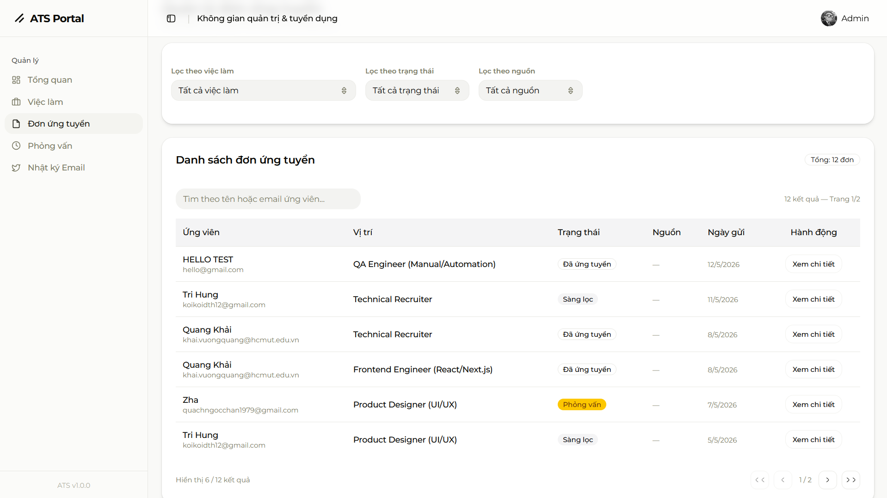
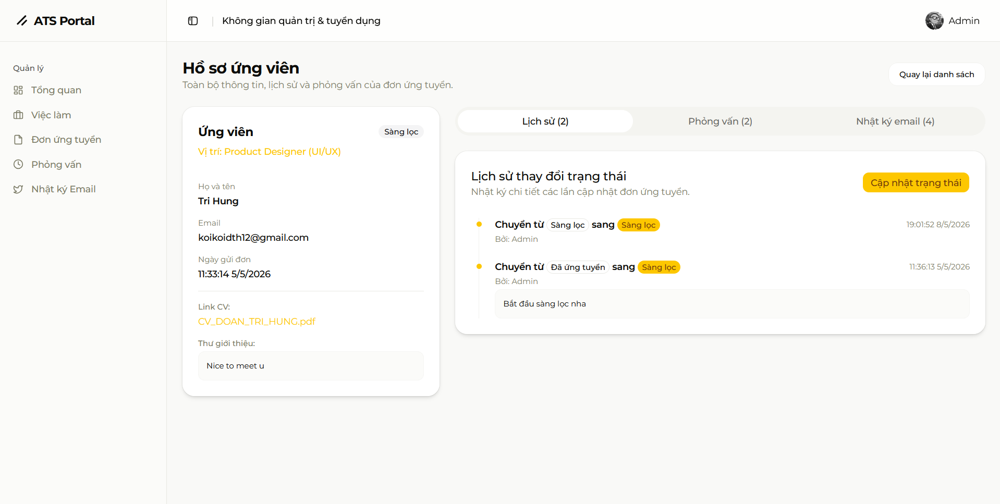
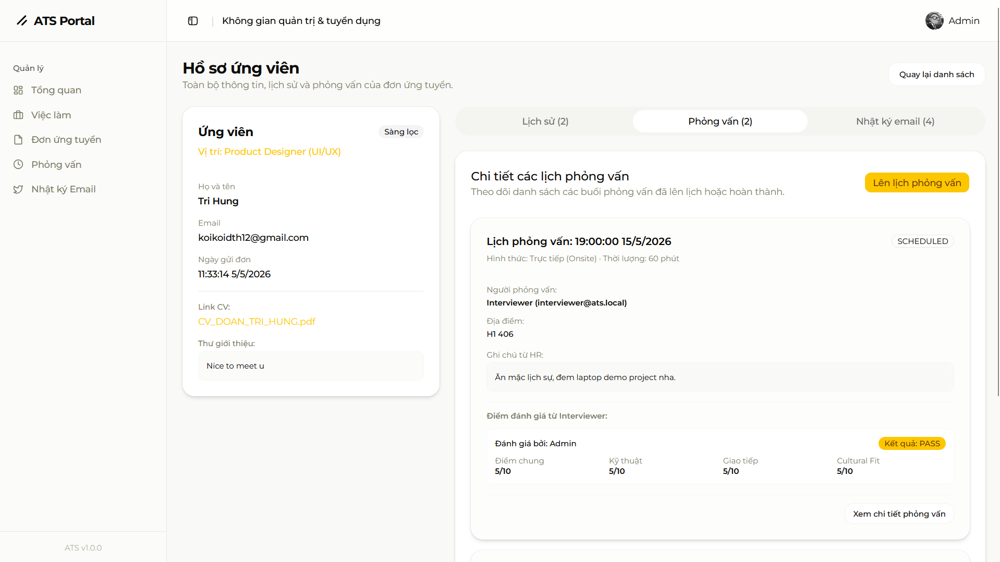
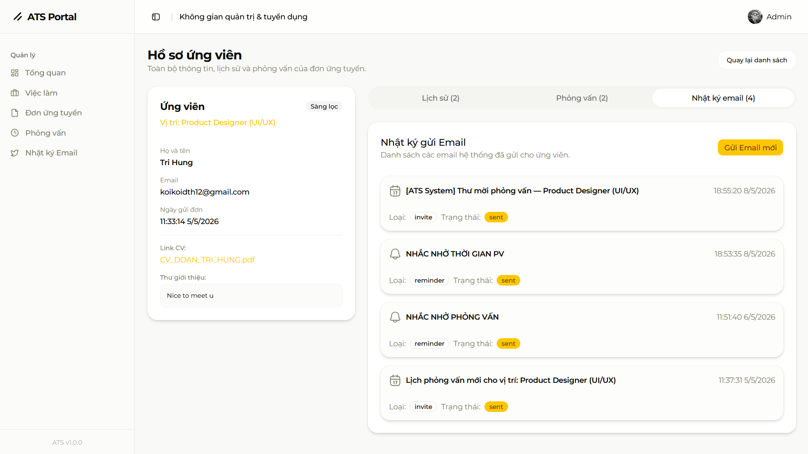
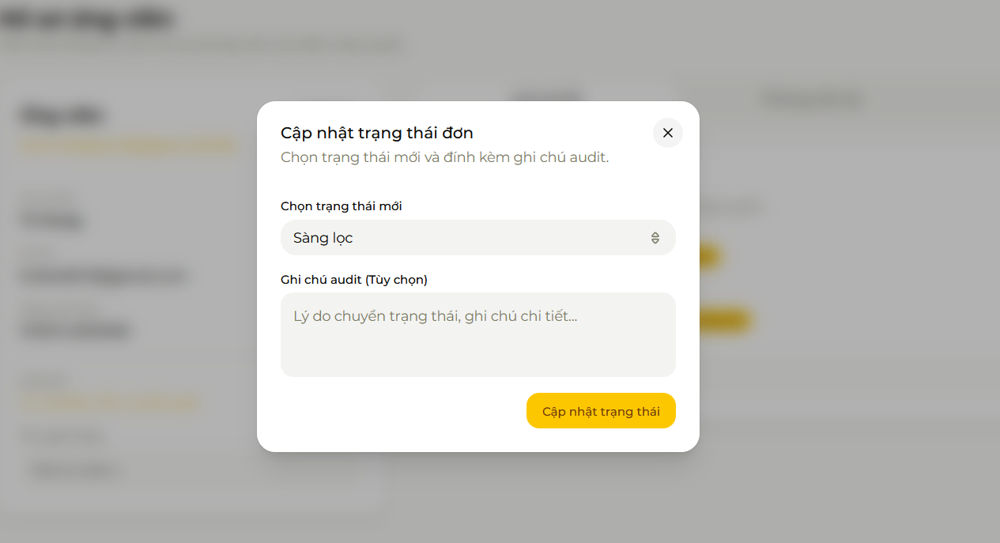
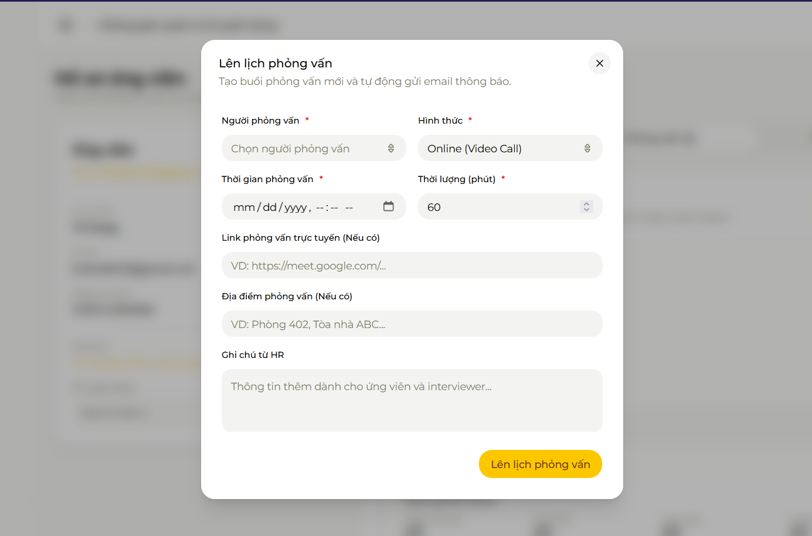
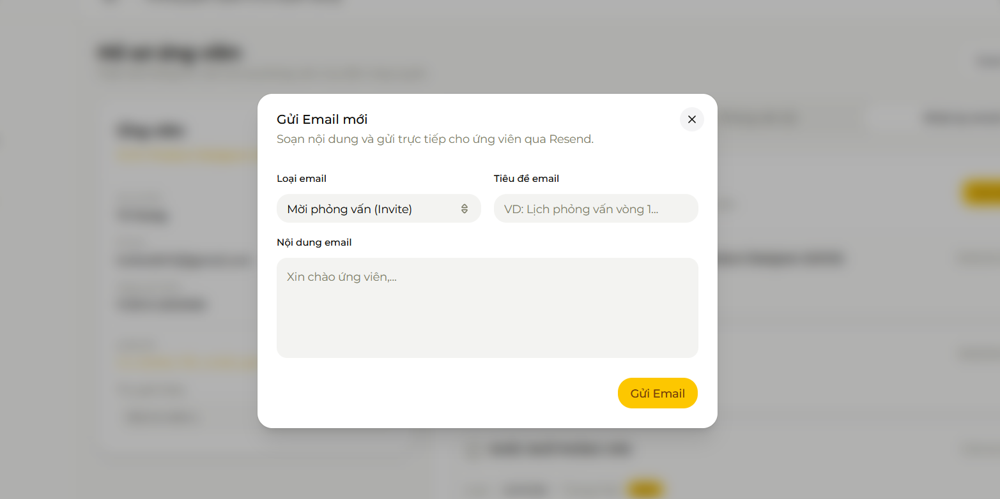

# Module E - Quản lý Đơn ứng tuyển (Applications)

**Người phụ trách:** Lê Đức Anh Tuấn

## Mục lục

1. [Sheet 01 - Khái quát chức năng](#sheet-01)
2. [Sheet 02 - IPO](#sheet-02)
3. [Sheet 03 - IPO Chi tiết](#sheet-03)
4. [Sheet 04 - Chi tiết điều khiển](#sheet-04)
5. [Sheet 05 - Giao diện màn hình](#sheet-05)
6. [Sheet 06 - Thông báo](#sheet-06)
7. [Sheet 07 - API](#sheet-07)
8. [Sheet 08 - Request](#sheet-08)
9. [Sheet 09 - Response](#sheet-09)
10. [Sheet 10 - SQL](#sheet-10)
11. [Lịch sử thay đổi](#lich-su-thay-doi)

---

<a id="sheet-01"></a>
## Sheet 01 - Khái quát chức năng

### 1. Khái quát chức năng

Module E gồm **3 màn hình** trong `/dashboard/applications`:

| No | Màn hình | Route | Chức năng chính |
|---:|---|---|---|
| 1 | Danh sách đơn | `/dashboard/applications` | Xem, lọc, tìm kiếm toàn bộ đơn ứng tuyển |
| 2 | Chi tiết đơn | `/dashboard/applications/[id]` | Xem chi tiết thông tin ứng viên + 3 Tab hành động |
| 3 | Đổi trạng thái (standalone) | `/dashboard/applications/[id]/status` | Form đổi trạng thái độc lập (có thể dùng ngoài dialog) |

**Màn hình Chi tiết (`[id]`)** là trung tâm của module, bao gồm **3 Tab**:

| Tab | key | Nội dung |
|---|---|---|
| Lịch sử | `audit-history` | Timeline thay đổi trạng thái + nút "Cập nhật trạng thái" (dialog) |
| Phỏng vấn | `interviews` | Danh sách lịch PV + điểm chấm + nút "Lên lịch phỏng vấn" (dialog) |
| Nhật ký email | `emails` | Danh sách email đã gửi + nút "Gửi Email mới" (dialog) |

### 2. Danh sách table sử dụng

| No | Table | Create | Read | Update | Delete | Ghi chú |
|---:|---|---|---|---|---|---|
| 1 | `applications` | - | x | x | - | Đọc danh sách + cập nhật status |
| 2 | `users` | - | x | - | - | Thông tin ứng viên (fullName, email) |
| 3 | `jobs` | - | x | - | - | Tên vị trí job (title) |
| 4 | `application_status_history` | x | x | - | - | Tạo audit log sau mỗi lần đổi trạng thái |
| 5 | `interviews` | x | x | - | - | Tạo lịch PV từ chi tiết đơn |
| 6 | `interview_scores` | - | x | - | - | Đọc điểm từ interviewer, hiển thị trong tab PV |
| 7 | `email_logs` | x | x | - | - | Ghi log sau mỗi lần gửi email qua Resend |

### 3. Đối tượng / Bộ phận sử dụng

| Vai trò | Xem danh sách | Xem chi tiết | Đổi trạng thái | Lên lịch PV | Gửi email |
|---|---|---|---|---|---|
| admin | x | x | x | x | x |
| hr | x | x | x | x | x |
| interviewer | x | x | - | - | - |
| candidate | - | - | - | - | - |

> Phân quyền: `session.user.role === "candidate"` → 401. Tất cả role khác (admin/hr/interviewer) đều truy cập được. Không phân biệt admin vs hr vs interviewer ở tầng API — UI ẩn nút action nếu cần.

---

<a id="sheet-02"></a>
## Sheet 02 - IPO

### 1. Danh sách nhóm chức năng

| No | Nhóm | Màn hình | Mô tả |
|---:|---|---|---|
| 1 | Xem danh sách đơn | `/dashboard/applications` | Filter jobId / status / source; hiển thị DataTable với search theo tên/email |
| 2 | Xem chi tiết đơn ứng tuyển | `/dashboard/applications/[id]` | Load đơn + lịch sử + PV + điểm + email logs + danh sách interviewers |
| 3 | Cập nhật trạng thái | Tab "Lịch sử" + `/[id]/status` | Chọn to_status + ghi chú → UPDATE applications + INSERT history |
| 4 | Lên lịch phỏng vấn | Tab "Phỏng vấn" (dialog) | Tạo interview record + tự động gửi email mời qua Resend |
| 5 | Gửi email cho ứng viên | Tab "Nhật ký email" (dialog) | Soạn subject/type/bodyText → gửi qua Resend → ghi email_logs |

### 2. Nhóm 1 — Xem danh sách đơn

| Thành phần | Nội dung |
|---|---|
| **Input** | JWT session; query: `jobId?`, `status?`, `source?` |
| **Process** | `findMany applications` WHERE các filter; JOIN users (fullName, email), jobs (id, title); ORDER BY applied_at DESC. Song song: `findMany jobs` để populate dropdown filter |
| **Output** | `{ applications: [...], jobs: [...] }` |

### 3. Nhóm 2 — Xem chi tiết đơn ứng tuyển

| Thành phần | Nội dung |
|---|---|
| **Input** | JWT; path param `id` |
| **Process** | `Promise.all([findUnique applications WITH include, findMany users WHERE role IN [admin,hr,interviewer]])` |
| **Include** | `users` (all fields), `jobs` (all fields), `application_status_history` (+ users: fullName/email), `interviews` (+ users: fullName/email, + interview_scores: + users), `email_logs` (ORDER BY created_at DESC) |
| **Output** | `{ application: {...}, interviewers: [{id, fullName, email}] }` |

### 4. Nhóm 3 — Cập nhật trạng thái

| Thành phần | Nội dung |
|---|---|
| **Input** | JWT; path param `id`; body: `{ to_status, note? }` |
| **Validate** | `to_status` bắt buộc; application phải tồn tại |
| **Process** | `prisma.$transaction`: UPDATE `applications.status = to_status`; INSERT `application_status_history` (`from_status = application.status`, `changed_by = session.user.id`) |
| **Output** | `{ success: true, message: "Đã cập nhật trạng thái đơn ứng tuyển thành công." }` |

### 5. Nhóm 4 — Lên lịch phỏng vấn

| Thành phần | Nội dung |
|---|---|
| **Input** | JWT; path param `id`; body: `{ interviewer_id, scheduled_at, duration_minutes?, type, meeting_link?, location?, notes? }` |
| **Validate** | `interviewer_id`, `scheduled_at`, `type` bắt buộc; application & interviewer phải tồn tại |
| **Process** | 1. Gửi email mời qua `sendInterviewInviteEmail` (Resend); nếu lỗi → 500 sớm. 2. `prisma.$transaction`: INSERT `interviews`; INSERT `email_logs` (type=invite, status=sent) |
| **Output** | `{ success: true, message: "Tạo lịch phỏng vấn và gửi email thành công.", data: newInterview }` |

### 6. Nhóm 5 — Gửi email cho ứng viên

| Thành phần | Nội dung |
|---|---|
| **Input** | JWT; path param `id`; body: `{ subject, type, bodyText }` |
| **Validate** | Cả 3 field bắt buộc; application phải tồn tại |
| **Process** | Lấy `application.users.email`; gọi `resend.emails.send`; nếu thành công → INSERT `email_logs` (status=sent, sent_at=NOW()) |
| **Output** | `{ success: true, message: "Gửi email qua Resend thành công.", data: newLog }` |

---

<a id="sheet-03"></a>
## Sheet 03 - IPO Chi tiết

### Danh sách method

| No | Method | API | Mô tả | Role |
|---:|---|---|---|---|
| E-01 | GET | `/api/dashboard/applications` | Danh sách + filter + jobs dropdown | admin/hr/interviewer |
| E-02 | GET | `/api/dashboard/applications/[id]` | Chi tiết đơn ứng tuyển + interviewers | admin/hr/interviewer |
| E-03 | POST | `/api/dashboard/applications/[id]/status` | Đổi trạng thái + tạo history | admin/hr/interviewer |
| E-04 | POST | `/api/dashboard/applications/[id]/email` | Gửi email qua Resend + log | admin/hr/interviewer |
| E-05 | POST | `/api/dashboard/applications/[id]/interviews` | Tạo lịch PV + gửi email invite | admin/hr/interviewer |
| E-06 | GET | `/api/dashboard/applications/[id]/emails` | Danh sách email logs của đơn | admin/hr/interviewer |

### Chi tiết E-01: GET /api/dashboard/applications

```
Query params: jobId?, status?, source?
WHERE:
  job_id        = :jobId   (nếu có)
  status        = :status  (nếu có)
  source_channel = :source  (nếu có)
JOIN users { id, fullName, email }
JOIN jobs  { id, title }
ORDER BY applied_at DESC

+ Song song: findMany jobs { id, title } ORDER BY title ASC
```

### Chi tiết E-02: GET /api/dashboard/applications/[id]

```
Promise.all([
  findUnique applications WHERE id = :id
    INCLUDE users (ALL)
    INCLUDE jobs (ALL)
    INCLUDE application_status_history ORDER BY changed_at DESC
      INCLUDE users { fullName, email }
    INCLUDE interviews ORDER BY scheduled_at DESC
      INCLUDE users { fullName, email }
      INCLUDE interview_scores
        INCLUDE users { fullName, email }
    INCLUDE email_logs ORDER BY created_at DESC
  ,
  findMany users WHERE role IN ['admin','hr','interviewer']
    SELECT { id, fullName, email }
])
```

### Chi tiết E-03: POST /api/dashboard/applications/[id]/status

```
Validate: to_status required
Find application → 404 nếu không có
$transaction [
  UPDATE applications SET status=to_status, updated_at=NOW()
  INSERT application_status_history {
    application_id, changed_by=session.user.id,
    from_status=application.status, to_status, note
  }
]
```

### Chi tiết E-04: POST /api/dashboard/applications/[id]/email

```
Validate: subject, type, bodyText required
Find application + users → 404 nếu không có
resend.emails.send({ from, to: [recipientEmail], subject, html })
→ nếu Resend lỗi: return 500
INSERT email_logs { application_id, recipient_id, sender_id, subject, type, status='sent', sent_at }
```

### Chi tiết E-05: POST /api/dashboard/applications/[id]/interviews

```
Validate: interviewer_id, scheduled_at, type required
Find application (+ users, jobs) → 404
Find interviewer user → 404
sendInterviewInviteEmail(...) → nếu lỗi: return 500
$transaction [
  INSERT interviews { application_id, interviewer_id, scheduled_at, duration_minutes, type, meeting_link, location, notes }
  INSERT email_logs { type='invite', status='sent', sent_at }
]
```

---

<a id="sheet-04"></a>
## Sheet 04 - Chi tiết điều khiển

### Màn hình 1 — `/dashboard/applications` (Danh sách)

| No | Tên control | Loại | I/O | Check nhập | Ghi chú |
|---:|---|---|---|---|---|
| 1 | Dropdown "Lọc theo việc làm" | SELECT | I | Tùy chọn | Populate từ `jobs` trong API response; "Tất cả việc làm" = all |
| 2 | Dropdown "Lọc theo trạng thái" | SELECT | I | Tùy chọn | applied/screening/interviewing/offered/hired/rejected + "Tất cả" |
| 3 | Dropdown "Lọc theo nguồn" | SELECT | I | Tùy chọn | website/linkedin/itviec/topcv/vietnamworks + "Tất cả" |
| 4 | Nút "Xoá lọc" | BUTTON | I | Hiện khi có filter đang active | Reset cả 3 filter về "all" |
| 5 | DataTable | TABLE | O | - | Columns: Ứng viên (fullName + email), Vị trí, Trạng thái (badge), Nguồn, Ngày gửi, Hành động |
| 6 | Search trong DataTable | INPUT | I | - | searchKey="candidate" — tìm theo fullName + email |
| 7 | Badge trạng thái | BADGE | O | - | applied=outline, screening=secondary, interviewing=default, offered=default, hired=default, rejected=destructive |
| 8 | Link "Xem chi tiết" | LINK | I | - | href="/dashboard/applications/[id]" |
| 9 | Badge "Tổng: N đơn" | BADGE | O | - | Hiển thị số row sau filter |
| 10 | Loading state | TEXT | O | - | "Đang tải danh sách đơn ứng tuyển..." |

### Màn hình 2 — `/dashboard/applications/[id]` (Chi tiết — Cột trái: Card ứng viên)

| No | Tên control | Loại | I/O | Ghi chú |
|---:|---|---|---|---|
| 1 | Tiêu đề "Hồ sơ ứng viên" | TEXT | O | H1 + mô tả |
| 2 | Link "Quay lại danh sách" | LINK | I | href="/dashboard/applications" |
| 3 | Badge trạng thái hiện tại | BADGE | O | Hiển thị trong Card header |
| 4 | Vị trí (job title) | TEXT | O | `application.jobs.title` |
| 5 | Họ tên ứng viên | TEXT | O | `application.users.fullName` |
| 6 | Email ứng viên | TEXT | O | `application.users.email` |
| 7 | Ngày gửi đơn | TEXT | O | `toLocaleString("vi-VN")` |
| 8 | Link CV | LINK | O | href=cv_file_url, target="_blank"; label = cv_filename nếu có |
| 9 | Cover letter | TEXT | O | Hiện trong box muted nếu có |
| 10 | Skeleton loading | SKELETON | O | Hiện khi isLoading |
| 11 | Card lỗi 404 / API error | CARD | O | "Không tìm thấy đơn" hoặc "Không thể tải dữ liệu" + nút quay lại |

### Màn hình 2 — Cột phải: 3 Tabs

| No | Tab | key | Mặc định | Nội dung |
|---:|---|---|---|---|
| 1 | Lịch sử (N) | `audit-history` | **active** | Timeline thay đổi + nút "Cập nhật trạng thái" |
| 2 | Phỏng vấn (N) | `interviews` | - | Danh sách card PV + điểm chấm + nút "Lên lịch phỏng vấn" |
| 3 | Nhật ký email (N) | `emails` | - | Danh sách email đã gửi + nút "Gửi Email mới" |

### Tab "Lịch sử"

| No | Control | Loại | I/O | Ghi chú |
|---:|---|---|---|---|
| 1 | Timeline audit history | LIST | O | Mỗi item: badge from→to, người thay đổi, thời gian, ghi chú |
| 2 | Nút "Cập nhật trạng thái" | BUTTON | I | Mở Dialog StatusUpdateDialog |
| 3 | Dialog cập nhật trạng thái | DIALOG | I/O | Chứa StatusForm (SELECT + TEXTAREA + submit) |
| 4 | Dropdown trạng thái mới | SELECT | I | 6 trạng thái: applied→rejected |
| 5 | Textarea ghi chú audit | TEXTAREA | I | Tùy chọn; "Lý do chuyển trạng thái..." |
| 6 | Nút submit trạng thái | BUTTON | I | "Cập nhật trạng thái" — disabled khi isPending |
| 7 | Empty state | TEXT | O | "Chưa có thay đổi nào." khi history = [] |

### Tab "Phỏng vấn"

| No | Control | Loại | I/O | Ghi chú |
|---:|---|---|---|---|
| 1 | Danh sách Card PV | CARD_LIST | O | Ngày giờ PV, hình thức, thời lượng, interviewer, link/địa điểm, ghi chú |
| 2 | Badge trạng thái PV | BADGE | O | `iv.status` (uppercase) |
| 3 | Link "Xem chi tiết phỏng vấn" | LINK | I | href="/dashboard/interviews/[iv.id]" |
| 4 | Scorecard (nếu có điểm) | SECTION | O | overall/technical/communication/cultural_fit (N/10), kết quả PASS/FAIL/HOLD, feedback |
| 5 | Nút "Lên lịch phỏng vấn" | BUTTON | I | Mở Dialog CreateInterviewForm |
| 6 | Dialog lên lịch PV | DIALOG | I/O | Form CreateInterviewForm |
| 7 | SELECT Người phỏng vấn | SELECT | I | Bắt buộc (*); populate từ `interviewers` trong response |
| 8 | SELECT Hình thức | SELECT | I | Bắt buộc (*); video/phone/onsite/technical |
| 9 | INPUT datetime-local | INPUT | I | Bắt buộc (*) |
| 10 | INPUT Thời lượng (phút) | INPUT NUMBER | I | Bắt buộc (*); default=60; min=1 |
| 11 | INPUT Link phỏng vấn | INPUT URL | I | Tùy chọn |
| 12 | INPUT Địa điểm | INPUT TEXT | I | Tùy chọn |
| 13 | TEXTAREA Ghi chú HR | TEXTAREA | I | Tùy chọn |
| 14 | Nút "Lên lịch phỏng vấn" | BUTTON SUBMIT | I | disabled khi isLoading |
| 15 | Empty state | TEXT | O | "Chưa có lịch phỏng vấn nào." |

### Tab "Nhật ký email"

| No | Control | Loại | I/O | Ghi chú |
|---:|---|---|---|---|
| 1 | Danh sách Card email | CARD_LIST | O | Subject, loại email (badge), trạng thái (sent=default/failed=destructive), sent_at |
| 2 | Icon theo loại email | ICON | O | invite=Calendar, result=Checkmark, reminder=Notification, rejection=CancelCircle, offer=Mail |
| 3 | Error message | TEXT | O | Hiển thị `log.error_message` nếu failed |
| 4 | Nút "Gửi Email mới" | BUTTON | I | Mở Dialog SendEmailForm |
| 5 | Dialog gửi email | DIALOG | I/O | Form SendEmailForm |
| 6 | SELECT Loại email | SELECT | I | Bắt buộc; invite/result/reminder/rejection/offer |
| 7 | INPUT Tiêu đề email | INPUT TEXT | I | Bắt buộc |
| 8 | TEXTAREA Nội dung email | TEXTAREA | I | Bắt buộc; rows=5 |
| 9 | Nút "Gửi Email" | BUTTON SUBMIT | I | disabled khi isPending |
| 10 | Empty state | TEXT | O | "Chưa có email nào." |

### Màn hình 3 — `/dashboard/applications/[id]/status` (Standalone)

| No | Control | Loại | I/O | Ghi chú |
|---:|---|---|---|---|
| 1 | Link "Quay lại hồ sơ ứng tuyển" | LINK | I | href="/dashboard/applications/[id]" |
| 2 | Tiêu đề + mô tả đơn | TEXT | O | Họ tên ứng viên + tên vị trí |
| 3 | Form đổi trạng thái (StatusForm) | FORM | I/O | Dùng chung với dialog trong màn hình 2 |

---

<a id="sheet-05"></a>
## Sheet 05 - Giao diện màn hình

### 1. Danh sách màn hình









| No | Tên | Route | Loại | Liên kết API |
|---:|---|---|---|---|
| 1 | Danh sách đơn | `/dashboard/applications` | Danh sách + Filter | E-01 |
| 2 | Chi tiết đơn ứng tuyển | `/dashboard/applications/[id]` | Chi tiết + 3 Tab + 3 Dialog | E-02, E-03, E-04, E-05 |
| 3 | Đổi trạng thái standalone | `/dashboard/applications/[id]/status` | Form | E-03 |
| 4 | Nhật ký email (trang riêng) | `/dashboard/applications/[id]/emails` | Danh sách | E-06 |

### 2. Rule hiển thị màn hình 1

| No | Trường hợp | Điều kiện | Hiển thị |
|---:|---|---|---|
| 1 | Đang tải | isLoading | "Đang tải danh sách đơn ứng tuyển..." |
| 2 | Có dữ liệu | applications.length > 0 | DataTable đầy đủ |
| 3 | Không có đơn | applications.length = 0 | DataTable trống + empty state của TanStack Table |
| 4 | Filter active | jobId/status/source ≠ "all" | Nút "Xoá lọc" hiện; kết quả lọc |
| 5 | API lỗi | - | React Query error handling |

### 3. Rule hiển thị màn hình 2

| No | Trường hợp | Điều kiện | Hiển thị |
|---:|---|---|---|
| 1 | Đang tải | isLoading | DetailSkeleton (aria-busy) |
| 2 | Đơn không tồn tại | error.status = 404 | Card "Không tìm thấy đơn" |
| 3 | API lỗi khác | isError | Card "Không thể tải dữ liệu" |
| 4 | Load thành công | data OK | Card ứng viên (trái) + 3 Tab (phải) |

### 4. Rule validation màn hình 2

#### Form đổi trạng thái



| No | Field | Rule | Lỗi |
|---:|---|---|---|
| 1 | to_status | Bắt buộc | `toast.error("Vui lòng chọn trạng thái mới.")` |

#### Form lên lịch phỏng vấn



| No | Field | Rule | Lỗi |
|---:|---|---|---|
| 1 | interviewer_id | Bắt buộc | Msg inline "Vui lòng điền đầy đủ các trường thông tin bắt buộc (*)" |
| 2 | scheduled_at | Bắt buộc | Như trên |
| 3 | type | Bắt buộc | Như trên |
| 4 | duration_minutes | min=1 | HTML5 native |

#### Form gửi email



| No | Field | Rule | Lỗi |
|---:|---|---|---|
| 1 | subject | Bắt buộc (trim) | Msg inline "Vui lòng nhập đầy đủ Tiêu đề, Loại email và Nội dung." |
| 2 | type | Bắt buộc | Như trên |
| 3 | bodyText | Bắt buộc (trim) | Như trên |

---

<a id="sheet-06"></a>
## Sheet 06 - Thông báo

| MessageCD | Loại | Nội dung | Khi nào |
|---|---|---|---|
| E-SUC-001 | Toast Success | Cập nhật trạng thái thành công! | POST .../status 200 |
| E-SUC-002 | Msg inline Success | Gửi email qua Resend thành công. | POST .../email 200 |
| E-SUC-003 | Msg inline Success | Tạo lịch phỏng vấn và gửi email thành công. | POST .../interviews 200 |
| E-ERR-001 | Toast Error | [err.message] hoặc "Đã xảy ra lỗi khi cập nhật." | POST .../status lỗi |
| E-ERR-002 | Msg inline Error | Vui lòng nhập đầy đủ Tiêu đề, Loại email và Nội dung. | Form email validate |
| E-ERR-003 | Msg inline Error | Không thể gửi email. Vui lòng thử lại. | POST .../email lỗi |
| E-ERR-004 | Msg inline Error | Vui lòng điền đầy đủ các trường thông tin bắt buộc (*). | Form PV validate |
| E-ERR-005 | Msg inline Error | Không thể tạo lịch phỏng vấn. | POST .../interviews lỗi |
| E-ERR-006 | Toast Error | Vui lòng chọn trạng thái mới. | StatusForm validate |
| E-404 | Card | Đơn ứng tuyển không tồn tại hoặc đã bị xoá. | GET [id] → 404 |
| E-API-ERR | Card | Đã có lỗi xảy ra. Vui lòng thử lại. | GET [id] → lỗi khác |

---

<a id="sheet-07"></a>
## Sheet 07 - API

### 1. Danh sách API

| No | Method | Endpoint | Role cho phép | Status OK |
|---:|---|---|---|---|
| E-01 | GET | `/api/dashboard/applications` | admin, hr, interviewer | 200 |
| E-02 | GET | `/api/dashboard/applications/[id]` | admin, hr, interviewer | 200 |
| E-03 | POST | `/api/dashboard/applications/[id]/status` | admin, hr, interviewer | 200 |
| E-04 | POST | `/api/dashboard/applications/[id]/email` | admin, hr, interviewer | 200 |
| E-05 | POST | `/api/dashboard/applications/[id]/interviews` | admin, hr, interviewer | 200 |
| E-06 | GET | `/api/dashboard/applications/[id]/emails` | admin, hr | 200 |

### 2. Phân quyền

Tất cả endpoint kiểm tra:
```
if (!session || session.user.role === "candidate") → 401
```

---

<a id="sheet-08"></a>
## Sheet 08 - Request

### E-01: GET /api/dashboard/applications

```
GET /api/dashboard/applications?jobId=uuid&status=screening&source=linkedin
```

| Param | Bắt buộc | Mô tả |
|---|---|---|
| `jobId` | Không | ID job để filter; bỏ qua nếu không có |
| `status` | Không | applied / screening / interviewing / offered / hired / rejected |
| `source` | Không | website / linkedin / itviec / topcv / vietnamworks |

### E-03: POST /api/dashboard/applications/[id]/status

```json
{
  "to_status": "screening",
  "note": "Hồ sơ phù hợp, chuyển sang vòng sàng lọc kỹ hơn."
}
```

| Field | Bắt buộc | Mô tả |
|---|---|---|
| `to_status` | Có | applied / screening / interviewing / offered / hired / rejected |
| `note` | Không | Ghi chú audit tự do |

### E-04: POST /api/dashboard/applications/[id]/email

```json
{
  "subject": "Lịch phỏng vấn vòng 1 — Vị trí Senior Frontend Developer",
  "type": "invite",
  "bodyText": "Kính gửi ứng viên,\n\nChúng tôi trân trọng mời bạn tham gia phỏng vấn..."
}
```

| Field | Bắt buộc | Mô tả |
|---|---|---|
| `subject` | Có | Tiêu đề email |
| `type` | Có | invite / result / reminder / rejection / offer |
| `bodyText` | Có | Nội dung thuần text (backend convert `\n` → `<br>`) |

### E-05: POST /api/dashboard/applications/[id]/interviews

```json
{
  "interviewer_id": "uuid-interviewer",
  "scheduled_at": "2026-06-01T09:00",
  "duration_minutes": 60,
  "type": "video",
  "meeting_link": "https://meet.google.com/abc-xyz",
  "location": null,
  "notes": "Chuẩn bị bài test thuật toán 30 phút đầu."
}
```

| Field | Bắt buộc | Mô tả |
|---|---|---|
| `interviewer_id` | Có | UUID user có role admin/hr/interviewer |
| `scheduled_at` | Có | Datetime string (datetime-local format) |
| `type` | Có | phone / video / onsite / technical |
| `duration_minutes` | Không | Integer, default=60 |
| `meeting_link` | Không | URL họp trực tuyến |
| `location` | Không | Địa điểm onsite |
| `notes` | Không | Ghi chú từ HR |

---

<a id="sheet-09"></a>
## Sheet 09 - Response

### E-01: GET /api/dashboard/applications — 200

```json
{
  "success": true,
  "data": {
    "applications": [
      {
        "id": "uuid",
        "status": "screening",
        "source_channel": "linkedin",
        "applied_at": "2026-05-01T10:00:00.000Z",
        "users": { "id": "uuid", "fullName": "Nguyễn Văn A", "email": "a@mail.com" },
        "jobs": { "id": "uuid", "title": "Senior Frontend Developer" }
      }
    ],
    "jobs": [
      { "id": "uuid", "title": "Senior Frontend Developer" },
      { "id": "uuid", "title": "Backend Engineer" }
    ]
  }
}
```

### E-02: GET /api/dashboard/applications/[id] — 200

```json
{
  "success": true,
  "data": {
    "application": {
      "id": "uuid",
      "status": "interviewing",
      "cv_file_url": "https://...",
      "cv_filename": "CV_2026.pdf",
      "cover_letter": "Kính gửi...",
      "applied_at": "2026-05-01T10:00:00.000Z",
      "users": { "id": "uuid", "fullName": "Nguyễn Văn A", "email": "a@mail.com", "..." },
      "jobs": { "id": "uuid", "title": "Senior Frontend Developer", "..." },
      "application_status_history": [
        {
          "id": "uuid",
          "from_status": "applied",
          "to_status": "screening",
          "note": "CV ổn",
          "changed_at": "2026-05-02T08:00:00.000Z",
          "users": { "fullName": "HR Manager", "email": "hr@company.com" }
        }
      ],
      "interviews": [
        {
          "id": "uuid",
          "scheduled_at": "2026-05-10T09:00:00.000Z",
          "duration_minutes": 60,
          "type": "video",
          "status": "scheduled",
          "meeting_link": "https://meet.google.com/...",
          "location": null,
          "notes": null,
          "users": { "fullName": "Interviewer A", "email": "iv@company.com" },
          "interview_scores": [
            {
              "id": "uuid",
              "overall_score": 8,
              "technical_score": 7,
              "communication_score": 9,
              "cultural_fit_score": 8,
              "result": "pass",
              "feedback": "Ứng viên tốt",
              "users": { "fullName": "Interviewer A", "email": "iv@company.com" }
            }
          ]
        }
      ],
      "email_logs": [
        {
          "id": "uuid",
          "subject": "Lịch phỏng vấn",
          "type": "invite",
          "status": "sent",
          "sent_at": "2026-05-09T10:00:00.000Z",
          "error_message": null
        }
      ]
    },
    "interviewers": [
      { "id": "uuid", "fullName": "Interviewer A", "email": "iv@company.com" }
    ]
  }
}
```

### E-03: POST .../status — 200

```json
{ "success": true, "message": "Đã cập nhật trạng thái đơn ứng tuyển thành công." }
```

### E-04: POST .../email — 200

```json
{
  "success": true,
  "message": "Gửi email qua Resend thành công.",
  "data": { "id": "uuid", "status": "sent", "sent_at": "..." }
}
```

### E-05: POST .../interviews — 200

```json
{
  "success": true,
  "message": "Tạo lịch phỏng vấn và gửi email thành công.",
  "data": { "id": "uuid", "scheduled_at": "...", "type": "video", "..." }
}
```

### Lỗi chung

```json
{ "success": false, "error": "Mô tả lỗi" }
```

| Status | Trường hợp |
|---|---|
| 400 | Thiếu field bắt buộc |
| 401 | Chưa đăng nhập hoặc role = candidate |
| 404 | Application / interviewer không tồn tại |
| 500 | Lỗi DB / Resend gửi email thất bại |

---

<a id="sheet-10"></a>
## Sheet 10 - SQL

### Danh sách đơn (filter)

```sql
SELECT
  a.id, a.status, a.source_channel, a.applied_at,
  u.id AS user_id, u.full_name, u.email,
  j.id AS job_id, j.title
FROM applications a
  JOIN users u ON u.id = a.candidate_id
  JOIN jobs  j ON j.id = a.job_id
WHERE
  (:jobId    IS NULL OR a.job_id         = :jobId)
  AND (:status IS NULL OR a.status        = :status)
  AND (:source IS NULL OR a.source_channel = :source)
ORDER BY a.applied_at DESC;
```

### Chi tiết đơn (main query)

```sql
SELECT a.*, u.*, j.*
FROM applications a
  JOIN users u ON u.id = a.candidate_id
  JOIN jobs  j ON j.id = a.job_id
WHERE a.id = :applicationId;
```

### Lịch sử trạng thái

```sql
SELECT h.*, u.full_name, u.email
FROM application_status_history h
  JOIN users u ON u.id = h.changed_by
WHERE h.application_id = :applicationId
ORDER BY h.changed_at DESC;
```

### Cập nhật trạng thái (transaction)

```sql
-- 1. Lưu trạng thái cũ trước khi UPDATE
UPDATE applications
SET status = :to_status, updated_at = NOW()
WHERE id = :applicationId;

-- 2. Ghi audit log
INSERT INTO application_status_history
  (id, application_id, changed_by, from_status, to_status, note)
VALUES
  (UUID(), :applicationId, :userId, :fromStatus, :toStatus, :note);
```

### Tạo lịch phỏng vấn (transaction)

```sql
-- 1. Tạo interview
INSERT INTO interviews
  (id, application_id, interviewer_id, scheduled_at, duration_minutes, type, meeting_link, location, notes)
VALUES
  (UUID(), :appId, :interviewerId, :scheduledAt, :duration, :type, :link, :location, :notes);

-- 2. Ghi email log invite
INSERT INTO email_logs
  (id, application_id, recipient_id, sender_id, subject, type, status, sent_at)
VALUES
  (UUID(), :appId, :candidateId, :senderId, :subject, 'invite', 'sent', NOW());
```

### Ghi email log (standalone send)

```sql
INSERT INTO email_logs
  (id, application_id, recipient_id, sender_id, subject, type, status, sent_at)
VALUES
  (UUID(), :appId, :recipientId, :senderId, :subject, :type, 'sent', NOW());
```

---

<a id="lich-su-thay-doi"></a>
## 11. Lịch sử thay đổi

| Phiên bản | Ngày | Người thay đổi | Nội dung |
|---|---|---|---|
| 1.0 | 2026-05-17 | AI Agent | Khởi tạo tài liệu lần đầu (generate từ prompt template) |
| 1.1 | 2026-05-17 | AI Agent | Viết lại hoàn toàn theo source code thực tế: 3 màn hình (danh sách / chi tiết 3-tab / status standalone); cập nhật chi tiết dialog StatusUpdateDialog + CreateInterviewForm + SendEmailForm; API signature chính xác (body fields, transaction logic, Resend flow); bổ sung màn hình `/[id]/emails` |
